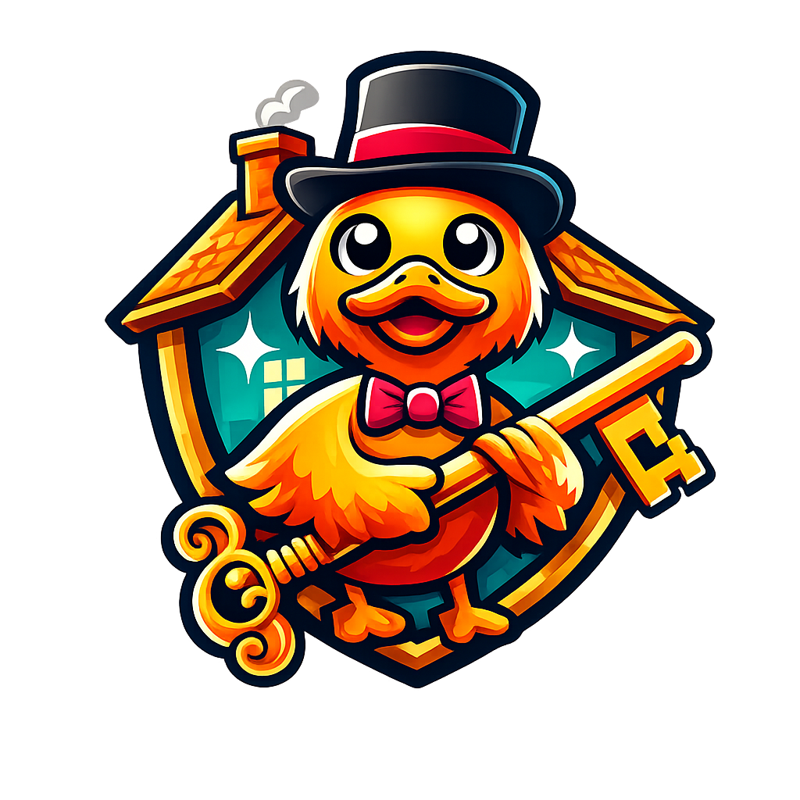

# ❄️🦆 **QuackHack-McBLindy NixOS dotfiles** <br>

<!-- VERSIONS_START -->


<!-- VERSIONS_END -->


<div align="right"><sub>

_This is a <abbr title="Magically automated with duck-powered quackery">automagiduckically</abbr> updated README.md_

</sub></div> 




[ "")](https://github.com/sponsors/QuackHack-McBlindy)


> [!CAUTION]
> __Do not blindly run this flake.__ <br>
> **That's my job.** 🧑‍🦯
<br>


__Here lives all home machines/phone config files,__  
__and home automations, fully reproducible,__  
__crafted as a tiny Nix flake__  
__Glued together by a Nix-flavoured command line utility,__  
__easiy expanded and used to deploy, doc, and duck around__


## **What Makes This Configuration Unique?** 

Nix declarative configuration style, custom modules evaluated dynamically for each host. <br>
Home Manager - __No ducking way!__ I just auto symlink ./home to /home <br>
Home Assistant - __Quack no!__ No assistance needed! <br>
Zigbee and smart home tightly integrated with Nix. For not just a declarative house but also deployable apartments. <br>
Not only that - my voice assistant is LIGHTNING FAST! (ms) ⚡🏆 <br><br>

<!-- SCRIPT_STATS_START -->
- __89 qwacktastic scripts in /bin - 57 scripts have voice commands.__ <br>
- __2490 dynamically generated regex patterns - makes 297584371 phrases available as commands.__ <br>
- __Smart Home Nix Fu - Managing 3 TV's, 48 devices & 11 scenes.__ <br>
- __Natural Language DevOps support with complete voice pipeline__ <br>
- __Mobile Frontend with Chatbot (no LLM) - Less thinking, more doing!__ <br>
- __Infra as everyday accessibility__ <br>
- __Yubikey encrypted deployment system__ <br>
- __Version controlled ESP32 firmware management__ <br>      
- __Self Documenting__ <br>

<!-- SCRIPT_STATS_END -->


_List would get long, very quackly._ <br>
_perhaps a more suitable question would be:_ <br>
_"What makes this configuration common?_" <br>


<br> 


## 🦆 **Follow My Adventures**

This repository is complex, and it's not a typical NixOS dotfiles setup.<br>
Since NixOS probably never have been used in such a unique way, understanding how everything is working solely from massive source code will be tricky for newcomers as well as advanced users. <br>
I try to simplify that process in my blog. <br> 

[𝑸𝓾𝒂𝒄𝒌𝑯𝒂𝒄𝒌-𝑴𝒄𝑩𝒍𝒊𝒏𝒅𝒚 𝗕𝗹𝗼𝗴](https://quackhack-mcblindy.github.io/blog/)

<br>

### Duck Challenge
  
<!-- DUCKS_START -->
I have hidden some ducks in the .nix files in this repository. <br>
Let's see if you can find all 8872 ducks? <br>

<!-- DUCKS_END -->

<br>
  
## ❄️ **Flake**

<details><summary><strong>
Define yourself at `config.this.user.me`.
</strong></summary>

<!-- USER_START -->
```nix
{
  discord = "https://discordapp.com/users/675530282849533952";
  dotfilesDir = "/home/pungkula/dotfiles";
  email = "isthisrandomenough@protonmail.com";
  extraGroups = [ "networkmanager" "wheel" "dialout" "docker" "dockeruser" "users" "pungkula" "adbusers" "audio" "2000" "i2c" ];
  hashedPassword = "$y$j9T$m8hPD36i1VMaO5rurbZ4j0$KpzQyat.F6NoWFKpisEj77TvpN2wBGB8ezd26QoKDj6";
  matrix = "";
  mobileDevices =   {
    iphone =     {
      pubkey = "UFB0T1Y/uLZi3UBtEaVhCi+QYldYGcOZiF9KKurC5Hw=";
      wgip = "10.0.0.7"
    };
    tablet =     {
      pubkey = "ETRh93SQaY+Tz/F2rLAZcW7RFd83eofNcBtfyHCBWE4=";
      wgip = "10.0.0.8"
    }
  };
  name = "pungkula";
  repo = "git@github.com:QuackHack-McBlindy/dotfiles.git"
}
```

<!-- USER_END -->

</details>


<details><summary><strong>
Define each hosts data at `config.this.host`.
</strong></summary>

<!-- HOST_START -->
```nix
{
  hostname = "desktop";
  interface = [ "enp119s0" ];
  ip = "192.168.1.111";
  keys =   {
    privateKeys =     {

    };
    publicKeys =     {
      adb = "QAAAACEJNfsfRV4PQ9Ah87MbTVbMkbXC6CAMDOR+0K6mIpv/4TSzYMkc2qit3Kryc55IVOjwR3fJRjj/uL549gZ7nEemWtcd3AsYQBp0iIEor8nu1L/V6jfsTY6Xe/pl06xoroy6OwZRWuDbZ4wD2xQRRQjfPd+JtYnMAWneM6r1V15uR67w4ITvjk3ckyfgNeLZMUwahMRjC3wSjaU9sAdKNmg8yPd8uHZ+mK6mstxJFAGEpnnm1lE7Z2r0DF6h6MKY1++dwhU+WM5BRDNiBg+D4i6fDW4+Z1I9ENuFnjT17zAxZXch04SNlG3O94BANYP7jmKp60OvtDL6msfphntuIUzMCkndF9De0Kv4lJdQxe1d+wf+AFpmtd/xtrk45YdMV+eWCJf2OkidaHmSj4ffkAobpun0VrkZN2Z1JymmdsvUbyMjAsby3Zun0xr3EocUS8Jy5TcsK/dcpD6CB5dqzlHhsHSAWt2TDwPzZYXgV1xc+q+PqM09OVN1xActJu75UMkg5b84U15hwQvYdwB8UaopMWWk6p064c7gxYSfH7fSxwkW2Jy1CElgJa55Pp4SZG9b/3B+VcNL1WSf6v/lvJqPbrRvBqvS0+e9wcFMNZtQKTX3n5X0wW1/czZPCQX+hmM8Uu1qrtaz4rKViIEGf4YR0/9eUGYQVfuAxAh8ZmsroJlnAAEAAQA= pungkula@desktop";
      age = "age16utg7mmk73cn3glrwthtm0p7mf6g3vrd48h3ucpn6wnf28pgxvcsh4rjjp";
      borg = "ssh-ed25519 AAAAC3NzaC1lZDI1NTE5AAAAIMVYczAOBSeS7WfSvzYDOS4Q9Ss+yxCf2G5MVfAALOx/";
      builder = "ssh-ed25519 AAAAC3NzaC1lZDI1NTE5AAAAINQ7c/AeIpmJS6cWQkHOe4ZEq3DXVRnjtTWuWfx6L46n";
      cache = "cache:/pbj1Agw2OoSSDZcClS69RHa1aNcwwTOX3GIEGKYwPc=";
      host = "ssh-ed25519 AAAAC3NzaC1lZDI1NTE5AAAAILdwPkRQxlbrbRGwEO5zMJ4m+7QqUQPZg1iqbd5HRP34";
      iPhone = "ssh-ed25519 AAAAC3NzaC1lZDI1NTE5AAAAIOMcmr+z7k/yCbrFg+JDgo8JCuWqNVYn10ajRbNTp8fq";
      ssh = "ssh-ed25519 AAAAC3NzaC1lZDI1NTE5AAAAIPwZL27kGTQDIlSe03abT9F24nSAizORyjo5cI3BD92s";
      wireguard = "Oq0ZaYAnOo5sLpV//OEFwLgjVCxPyeQqf8cZBASluWk="
    }
  };
  modules =   {
    hardware = [ "cpu/intel" "audio" ];
    networking = [ "default" "pool" ];
    programs = [ "default" "thunar" "firefox" "vesktop" ];
    services = [ "ssh" "default" "adb" "openrgb" "backup" "cache" "keyd" "jelly" "yo-rs" "yo-client" ];
    system = [ "nix" "pkgs" "gnome" "crossEnv" "gtk" ];
    virtualisation = [ "docker" "vm" ]
  };
  system = "x86_64-linux";
  wgip = "10.0.0.2"
}
```

<!-- HOST_END -->

</details>


<details><summary><strong>
Define any optional theme configuration at `config.this.theme`.
</strong></summary>

<!-- THEME_START -->
```nix
{
  cursorTheme =   {
    name = "Bibata-Modern-Classic";
    package = "/nix/store/bysvgfvs99c3zwvxfbkbkz8xfsmda8q3-bibata-cursors-2.0.7";
    size = 32
  };
  enable = false;
  fonts =   {
    monospace = "Fira Code";
    packages = [ "/nix/store/b2yrf20qpp2acy3xizkbcin1hyfv286y-fira-code-6.2" ];
    system = "Fira Sans"
  };
  gtkSettings =   {
    gtk-application-prefer-dark-theme = "1";
    gtk-cursor-theme-name = "Bibata-Modern-Classic";
    gtk-icon-theme-name = "elementary-xfce-icon-theme"
  };
  iconTheme =   {
    name = "Papirus-Dark";
    package = "/nix/store/cj1pgagbmyi2yzh9ism76yyx5y9f3qf0-papirus-icon-theme-20250501"
  };
  name = "gtk3.css";
  styles = "/nix/store/5yb5i296sijga5k65cdw2ib3hhwwq6iq-gtk3.css"
}
```

<!-- THEME_END -->

</details>


<details><summary><strong>
Define Zigbee-devices, scenes, automations, tv's, channels etc at `config.house`.
</strong></summary>

<!-- SMARTHOME_START -->
# dotfiles/modules/myHouse.nix ⮞ https://github.com/quackhack-mcblindy/dotfiles
```nix
# dotfiles/modules/myHouse.nix ⮞ https://github.com/quackhack-mcblindy/dotfiles
{ # 🦆 says ⮞ my house - qwack 
  config, # 🦆 says ⮞ more info ⮞ https://quackhack-mcblindy.github.io/blog/house/index.html
  lib,
  self,
  pkgs,
  ...
} : let # 🦆 say ⮞ load dash pages css files
  strip = text:
    builtins.replaceStrings [ "/*" "*/" ] [ "" "" ] text;

  # 🦆 says ⮞ load custom pages 4 dashboard
  customPages = import ./dashboard/customPages.nix { inherit lib config pkgs; };
  pages = customPages.pages;

  # 🦆 says ⮞ load css files
  css = {
    tv      = builtins.readFile ./themes/css/duckdash/tv.css;  
    health  = builtins.readFile ./themes/css/duckdash/health.css;
    chat    = builtins.readFile ./themes/css/duckdash/chat.css;
  };
  
  # 🦆 says ⮞ get house.tv configuration with debug info
  tvConfig = builtins.trace "TV config: ${builtins.toJSON config.house.tv}" config.house.tv;
    
  # 🦆 says ⮞ generate TV selector options with debug
  tvOptions = let
    tvNames = lib.attrNames tvConfig;
    options = lib.concatMapStrings (tvName: 
      let tv = tvConfig.${tvName};
      in if tv.enable then ''<option value="${tv.ip}">${tvName}</option>'' else ""
    ) tvNames;
  in builtins.trace "TV options: ${options}" options;

  # 🦆 says ⮞ dis fetch what host has Mosquitto
  sysHosts = lib.attrNames self.nixosConfigurations; 
  mqttAuth = "-u ${config.house.zigbee.mosquitto.username} -P $(cat ${config.house.zigbee.mosquitto.passwordFile})"; 

  # 🦆 says ⮞ icon map
  icons = {
    light = {
      ceiling         = "mdi:ceiling-light";
      strip           = "mdi:light-strip";
      spotlight       = "mdi:spotlight";
      bulb            = "mdi:lightbulb";
      bulb_color      = "mdi:lightbulb-multiple";
      desk            = "mdi:desk-lamp";
      floor           = "mdi:floor-lamp";
      wall            = "mdi:wall-sconce-round";
      chandelier      = "mdi:chandelier";
      pendant         = "mdi:vanity-light";
      nightlight      = "mdi:lightbulb-night";
      strip_rgb       = "mdi:led-strip-variant";
      reading         = "mdi:book-open-variant";
      candle          = "mdi:candle";
      ambient         = "mdi:weather-night";
    };
    sensor = {
      motion          = "mdi:motion-sensor";
      smoke           = "mdi:smoke-detector";
      water           = "mdi:water";
      contact         = "mdi:door";
      temperature     = "mdi:thermometer";
      humidity        = "mdi:water-percent";
    };
    remote            = "mdi:remote";
    outlet            = "mdi:power-socket-eu";
    dimmer            = "mdi:toggle-switch";
    pusher            = "mdi:gesture-tap-button";
    blinds            = "mdi:blinds";
  };


  Mqtt2jsonHistory = field: file: ''
    FILE="/var/lib/zigduck/${file}"
    VALUE=$(echo "$MQTT_PAYLOAD" | jq '.${field}')
    mkdir -p "$(dirname "$FILE")"
    if [ ! -s "$FILE" ]; then
      jq -n --argjson v "$VALUE" \
        '{ ${field}: $v, history: [$v] }' > "$FILE"
    else
      jq --argjson v "$VALUE" '
        .${field} = $v
        | .history += [$v]
        | .history = (.history[-200:])
      ' "$FILE" > "$FILE.tmp" && mv "$FILE.tmp" "$FILE"
    fi
  '';

  health = lib.mapAttrs (hostName: _: {
    enable = true;
    description = "Health Check: ${hostName}";
    topic = "zigbee2mqtt/health/${hostName}";
    actions = [
      {
         type = "shell";
         command = ''
           mkdir -p /var/lib/zigduck/health
           touch /var/lib/zigduck/health/${hostName}.json
           echo "$MQTT_PAYLOAD" > /var/lib/zigduck/health/${hostName}.json
        '';
       }
     ];
  }) self.nixosConfigurations;
  
in { # 🦆 duck say ⮞ qwack
  house = {
    media.root = "/Pool";
    # 🦆says⮞ what machine should output sound   
    soundHost = "desktop";
    # 🦆 says ⮞ ROOM CONFIGURATION
    rooms = {
      bedroom.icon    = "mdi:bed";
      hallway.icon    = "mdi:door";
      kitchen.icon    = "mdi:food-fork-drink";
      livingroom.icon = "mdi:sofa";
      wc.icon         = "mdi:toilet";
      tv-area.icon    = "mdi:television";
      other.icon      = "mdi:misc";
    };
    
    # 🦆 says ⮞ DASHBOARD CONFIOGURATION 
    dashboard = { 
      passwordFile = config.sops.secrets.api.path; # 🦆 says ⮞  safety firzt!      
      # 🦆 says ⮞  home page information cards
      statusCards = {
        calendar = {
          enable = true;
          title = "𝑪𝑨𝑳𝑬𝑵𝑫𝑨𝑹";
          group = "1";
          icon = "fas fa-calendar";
          color = "#ff0000";
          theme = "glass";
          filePath = "/var/lib/zigduck/calendar.json";
          jsonField = "today_date";
          format = "{value}";
          detailsJsonField = "today_events";
          detailsFormat = "{value}";
          chart = false;
          on_click_action = [
            {
              type = "shell";
              command = "yo say \"detta är ett ank test - testar ankor ankor anka naka naka ojojojjoj vad många ankor detta blev oj oj\" --host desktop";
            }
          ];  
        };
            
        # 🦆 says ⮞ Monero USD price ticker
        xmr = {
          enable = true;
          title = "𝑿𝑴𝑹";
          group = "tickers";
          icon = "fab fa-monero";
          color = "#a78bfa";
          theme = "colorful";
          filePath = "/var/lib/zigduck/xmr.json";
          jsonField = "current_price";
          format = "{value}";
          detailsJsonField = "7d_change";
          detailsFormat = "7d: {value}%";
          chart = true;
        };

        # 🦆 says ⮞ Bitcoin USD price ticker
        btc = {
          enable = true;
          title = "𝑩𝑻𝑪";
          group = "tickers";
          icon = "fab fa-bitcoin";
          color = "#ff6600";
          filePath = "/var/lib/zigduck/btc.json";
          jsonField = "current_price";
          format = "{value}";
          detailsJsonField = "7d_change";
          detailsFormat = "7d: {value}%";
          chart = true;
          historyField = "history";
        };

        # 🦆 says ⮞ kWh/price chart card
        energyPrice = {
          enable = true;
          title = "𝑷𝑹𝑰𝑪𝑬";
          group = "energy";
          icon = "fas fa-bolt";
          color = "#ffff00";
          filePath = "/var/lib/zigduck/energy_price.json";          
          jsonField = "current_price";
          format = "{value} SEK/kWh";          
          chart = true;
          historyField = "history";
        };

        # 🦆 says ⮞ energy usage card
        energyUsage = {
          enable = true;
          title = "USAGE";
          group = "energy";
          icon = "fas fa-bolt";
          color = "#ffff00";
          filePath = "/var/lib/zigduck/energy_usage.json";          
          jsonField = "monthly_usage";
          format = "{value} kWh";
          chart = true;
          historyField = "history";
        };  

        # 🦆 says ⮞ show indoor temperature
        temperature = {
          enable = true;
          title = "TEMPERATURE C";
          group = "sensors";
          icon = "fas fa-thermometer-half";
          color = "#e74c3c";
          theme = "glass";
          filePath = "/var/lib/zigduck/temperature.json";          
          jsonField = "temperature";
          format = "{value} °C";
          detailsFormat = "Temperature in Hallway";
          chart = true;
          historyField = "history";
        };                   
      };

      # 🦆 says ⮞ DASHBOARD PAGES (extra tabs)      
      pages = {    
        # 🦆 says ⮞ (TV) remote page 
        "3" = {
          icon = "fas fa-television";
          title = "remote";
          # 🦆 says ⮞ symlink epg to webserver
          files = { tv = "/var/lib/zigduck/tv"; };
          css = css.tv;
          code = pages.remote;
        };  
      
        # 🦆 says ⮞ system-wide health monitoring page
        "4" = {
          icon = "fas fa-notes-medical";
          title = "health";
          # 🦆 says ⮞ symlink directory to webserver
          files = { health = "/var/lib/zigduck/health"; };
          css = css.health;
          code = pages.health;
        };
        
        # 🦆says⮞ ChatBot (no LLM) - Less thinkin', more doin'!
        "5" = {
          icon = "fas fa-comments";
          title = "chat";
          css = css.chat;
          # 🦆 says ⮞ symlink TTS audio to frontend webserver
          files = { tts = "/var/lib/zigduck/tts"; };
          code = pages.chat;
        };
      
      };
    };
  
# 🦆 ⮞ ZIGBEE ⮜ 🐝
    zigbee = {
      # 🦆 says ⮞ encrypted zigbee network key
      networkKeyFile = config.sops.secrets.z2m_network_key.path;
      
      # 🦆 says ⮞ mosquitto authentication
      mosquitto = {
        host = "192.168.1.211";
        username = "mqtt";
        passwordFile = config.sops.secrets.mosquitto.path;
      };
      
      # 🦆 says ⮞ TV light syncin' 
      hueSyncBox = { 
        enable = true;
        # 🦆 says ⮞ sadly needed (i disable itz internet access - u should too)
        bridge = { 
          ip = "192.168.1.33";
          # 🦆 says ⮞ run the following to get api token:
          # curl -X POST http://192.168.1.33/api -d '{"devicetype":"house#nixos"}'
          passwordFile = config.sops.secrets.hueBridgeAPI.path;
        }; 
        syncBox = { # C42996020AAE
          ip = "192.168.1.34";
          passwordFile = config.sops.secrets.hueBridgeAPI.path;
          tv = "shield";
        };
      };
      
      # 🦆says⮞ coordinator configuration
      coordinator = {
        vendorId =  "10c4";
        productId = "ea60";
        symlink = "zigbee"; # 🦆 says ⮞ diz symlinkz da serial port to /dev/zigbee
      };
    
      # 🦆 says ⮞ when motion triggers lights
      darkTime = {
        enable = true;
        after = "14";
        before = "9";
        duration = "900";
      };
      
  # 🦆 ⮞ AUTOMATIONS ⮜
      automations = {  
      # 🦆 says ⮞ there are 6 different automation types
        # 🦆 says ⮞ + a greeting automation
        greeting = {
          enable = true;
          awayDuration = "7200";
          greeting = "Borta bra, hemma bäst. Välkommen idiot! ";
          delay = "10";
          sayOnHost = "desktop";
        };
        

        # 🦆 says ⮞ 1. MQTT triggered automations
        mqtt_triggered = {
          # 🦆say⮞ crypto tickers 
          xmr = {
            enable = true;
            description = "Updating XMR price data on dashboard";
            topic = "zigbee2mqtt/crypto/xmr/price";
            actions = [{ type = "shell"; command = Mqtt2jsonHistory "current_price" "xmr.json"; }];
          };            
          btc = {
            enable = true;
            description = "Updating BTC price data on dashboard";
            topic = "zigbee2mqtt/crypto/btc/price";
            actions = [{ type = "shell"; command = Mqtt2jsonHistory "current_price" "btc.json"; }];
          };
          # 🦆say⮞ energy tracking 
          energyPrice = {
            enable = true;
            description = "Updating energy data on dashboard";
            topic = "zigbee2mqtt/tibber/energy";
            actions = [{ type = "shell"; command = Mqtt2jsonHistory "current_price" "energy_price.json"; }];
          };
          energyUsage = {
            enable = true;
            description = "Updating energy data on dashboard";
            topic = "zigbee2mqtt/tibber/energy";
            actions = [{ type = "shell"; command = Mqtt2jsonHistory "monthly_usage" "energy_usage.json"; }];
          };   
          # 🦆say⮞ hallway temperature  
          temperature = {
            enable = true;
            description = "Updating temperature data on dashboard";
            topic = "zigbee2mqtt/Motion Sensor Hall";
            actions = [{ type = "shell"; command = Mqtt2jsonHistory "temperature" "temperature.json"; }];
          };
          # 🦆say⮞ calendar 
          calendar = {
            enable = true;
            description = "TUpdated today's events";
            topic = "zigbee2mqtt/calendar";
            actions = [
              {
                type = "shell";
                command = ''
                  iso_date=$(echo "$MQTT_PAYLOAD" | jq -r '.today_date')
                  formatted_date=$(date -d "$iso_date" +"%b %d")
                  MQTT_PAYLOAD=$(echo "$MQTT_PAYLOAD" | jq --arg d "$formatted_date" '.today_date = $d')
                  echo "$MQTT_PAYLOAD" > /var/lib/zigduck/calendar.json
                '';
              }
            ];
          };
          

          # 🦆say⮞ tv control 
          tv_command = {
            enable = true;
            description = "TV command sent";
            topic = "zigbee2mqtt/tvCommand";
            actions = [
              {
                type = "shell";
                command = ''
                  tv_command=$(echo "$MQTT_PAYLOAD" | jq -r '.tvCommand')
                  ip=$(echo "$MQTT_PAYLOAD" | jq -r '.ip // "192.168.1.223"')
                  yo tv --typ "$tv_command" --device "$ip"
                  echo "TV command received! Command: $tv_command. IP: $ip"
                '';
              }
            ];
          };
          tv_channel_change = {
            enable = true;
            description = "Change TV channel via yo command";
            topic = "zigbee2mqtt/tvChannelCommand";
            actions = [
              {
                type = "shell";
                command = ''
                  channel=$(echo "$MQTT_PAYLOAD" | jq -r '.tvChannel')
                  ip=$(echo "$MQTT_PAYLOAD" | jq -r '.ip // "192.168.1.223"')
                  yo tv --typ livetv --device "$ip" --search "$channel"
                '';
              }
            ];
          }; # 🦆says⮞health checks (from let block)
        } // health; 
        

        # 🦆 says ⮞ 2. room action automations
        room_actions = {
          hallway = { 
            door_opened = [];
            door_closed = [];
          };
          
          # 🦆 says ⮞ 
#          kitchen = { 
#            motion_not_detected = [
#              {
#                type = "shell";
#                command = ''
#                  power=$(jq -r '."Fläkt".power' /var/lib/zigduck/state.json)
#                  # 🦆 says ⮞ no need 2 turn off if it'z not on
#                  if (( power > 20 )); then
#                    yo mqtt_pub --topic "zigbee2mqtt/Fläkt/set" --message '{"countdown": 45}'
#                  fi
#                '';
#              }
#              { # 🦆 says ⮞  slow go light go bye bye
#                type = "scene";
#                command = "kitchenFadeOff";
#              }
#            ];  

#            motion_detected = [
#              { # 🦆 SCREAM ⮞ INSANT LIGHT QWACK
#                type = "scene";
#                command = "kitchenInstant";
#              }            
#              {
#                type = "shell";
#                command = ''
#                  STATE=$(jq -r '."Fläkt".state' /var/lib/zigduck/state.json)
#                  if [ "$STATE" = "OFF" ]; then               
#                    yo house --device "Fläkt" --state on
#                  fi
#                '';
#              }
#            ];
#          };  
          # 🦆 says ⮞ default actions already configured - room lights will turn on upon motion
          #bedroom = { 
            # 🦆 says ⮞ this will override that in bedroom
            #motion_detected = [
            #  {
            #    type = "scene";
            #    scene = "Chill Scene";
            #  }       
            #];
            #motion_not_detected = [
            #  {
            #    type = "mqtt";
            #    topic = "zigbee2mqtt/Sänggavel/set";
            #    message = ''{"state":"OFF", "brightness": 80}'';
            #  }              
            #];
#          };
        };
          
        # 🦆 says ⮞ 3. global actions automations  
        global_actions = {
          leak_detected = [
            {
              type = "shell";
              command = "yo notify '🚨 WATER LEAK DETECTED!'";
            }
          ];
          smoke_detected = [
            {
              type = "shell";
              command = "yo notify '🔥 SMOKE DETECTED!'";
            }
          ];
        };

        # 🦆 says ⮞ 4. dimmer actions automations
        dimmer_actions = {          
          bedroom = {
            off_hold_release = {
              enable = true;
              description = "Turn off all configured light devices";
              extra_actions = [];
              override_actions = [
                {
                  type = "scene";
                  command = "dark";
                }
                {
                  type = "mqtt";
                  topic = "zigbee2mqtt/Fläkt/set";
                  message = ''{"state":"OFF"}'';
                }
              ];
            };   
          };              
        };
        
        # 🦆 says ⮞ 5. time based automations
        time_based = {};
        
        # 🦆 says ⮞ 6. presence based automations
        presence_based = {};        
      };  


  # 🦆 ⮞ DEVICES ⮜      
      devices = { 
        # 🦆 says ⮞ Kitchen   
        "0x0017880103ca6e95" = { # 🦆 says ⮞ 64bit IEEE adress (this is the unique device ID)  
          friendly_name = "Dimmer Switch Kök"; # 🦆 says ⮞ simple human readable friendly name
          room = "kitchen"; # 🦆 says ⮞ bind to group
          type = "dimmer"; # 🦆 says ⮞ set a custom device type
          icon = icons.dimmer;
          endpoint = 1; # 🦆 says ⮞ endpoint to call the device on
          batteryType = "CR2450"; # 🦆 says ⮞ optional yo
        }; 
        "0x0017880102f0848a" = { 
          friendly_name = "Spotlight kök 1";
          room = "kitchen";
          type = "light";
          icon = icons.light.spotlight;
          endpoint = 11;
        };
        "0x0017880102f08526" = { friendly_name = "Spotlight Kök 2"; room = "kitchen"; type = "light"; icon = icons.light.spotlight; endpoint = 11; };
        "0x0017880103a0d280" = { friendly_name = "Uppe"; room = "kitchen"; type = "light"; icon = icons.light.strip; endpoint = 11; supports_color = true; };
        "0x0017880103e0add1" = { friendly_name = "Golvet"; room = "kitchen"; type = "light"; icon = icons.light.strip; endpoint = 11; supports_color = true; };
        "0xa4c13873044cb7ea" = { friendly_name = "Kök Bänk Slinga"; room = "kitchen"; type = "light"; icon = icons.light.strip; endpoint = 11; };
        "0x70ac08fffe9fa3d1" = { friendly_name = "Motion Sensor Kök"; room = "kitchen"; type = "motion"; icon = icons.sensor.motion; endpoint = 1; batteryType = "CR2032"; }; 
        "0xa4c1380afa9f7f3e" = { friendly_name = "Smoke Alarm Kitchen"; room = "kitchen"; type = "sensor"; icon = icons.sensor.smoke; endpoint = 1; };
        "0xa4c138b9aab1cf3f" = { friendly_name = "Fläkt"; room = "kitchen"; type = "outlet"; icon = icons.outlet; endpoint = 1; };
        # 🦆 says ⮞ LIVING ROOM
        "0x0c4314fffe179b05" = { friendly_name = "Larm"; room = "livingroom"; type = "outlet"; icon = icons.outlet; endpoint = 1; };    
        "0x0017880104f78065" = { friendly_name = "Dimmer Switch Vardagsrum"; room = "livingroom"; type = "dimmer"; icon = icons.dimmer; endpoint = 1; batteryType = "CR2450"; };
        "0x00178801037e754e" = { friendly_name = "Takkrona 1"; room = "livingroom"; type = "light"; icon = icons.light.chandelier; endpoint = 1; supports_color = true; };   
        "0x0017880103c73f85" = { friendly_name = "Takkrona 2"; room = "livingroom"; type = "light"; icon = icons.light.chandelier; endpoint = 1; supports_color = true; };  
        "0x0017880103f94041" = { friendly_name = "Takkrona 3"; room = "livingroom"; type = "light"; icon = icons.light.chandelier; endpoint = 1; supports_color = true; };                  
        "0x0017880103c753b8" = { friendly_name = "Takkrona 4"; room = "livingroom"; type = "light"; icon = icons.light.chandelier; endpoint = 1; supports_color = true; };  
        "0x54ef4410003e58e2" = { friendly_name = "Roller Shade"; room = "livingroom"; type = "blind"; icon = icons.blinds; endpoint = 1; };
        "0x0017880104540411" = { friendly_name = "PC"; room = "livingroom"; type = "light"; icon = icons.light.spotlight; endpoint = 11; supports_color = true; };
        "0x0017880102de8570" = { friendly_name = "Rustning"; room = "livingroom"; type = "light"; icon = icons.light.spotlight; endpoint = 11; supports_color = true; };
        "0x540f57fffe85c9c3" = { friendly_name = "Water Sensor"; room = "livingroom"; type = "sensor"; icon = icons.sensor.water; endpoint = 1; };
        # 🦆 says ⮞ HALLWAY
        "0x00178801021311c4" = { friendly_name = "Motion Sensor Hall"; room = "hallway"; type = "motion"; icon = icons.sensor.motion; endpoint = 1; batteryType = "AAA"; };#⮜ AAA-AWESOME 🦆 
        "0x00158d00053ec9b1" = { friendly_name = "Door Sensor Hall"; room = "hallway"; type = "sensor"; icon = icons.sensor.contact; endpoint = 1; };
        "0x0017880103eafdd6" = { friendly_name = "Tak Hall";  room = "hallway"; type = "light"; icon = icons.light.ceiling; supports_color = true; endpoint = 11; };
        "0x000b57fffe0e2a04" = { friendly_name = "Vägg"; room = "hallway"; type = "light"; icon = icons.light.wall; supports_temperature = true; endpoint = 1; };
        # 🦆 says ⮞ WC
        "0x001788010361b842" = { friendly_name = "WC 1"; room = "wc"; type = "light"; icon = icons.light.ceiling; supports_temperature = true; endpoint = 11; };
        "0x0017880103406f41" = { friendly_name = "WC 2"; room = "wc"; type = "light"; icon = icons.light.ceiling; supports_temperature = true; endpoint = 11; };
        # 🦆 says ⮞ BEDROOM  
        "0xa4c13832742c96f7" = { friendly_name = "Robot Arm 1"; room = "bedroom"; type = "pusher"; endpoint = 11; icon = icons.pusher; batteryType = "CR02"; };
        "0xa4c138387966b58d" = { friendly_name = "Robot Arm 2"; room = "bedroom"; type = "pusher"; endpoint = 11; icon = icons.pusher; batteryType = "CR02"; };
        "0xa4c1380c0a35052e" = { friendly_name = "Robot Arm 3"; room = "bedroom"; type = "pusher"; endpoint = 11; icon = icons.pusher; batteryType = "CR02"; };
        "0xa4c1381e74b6d2e6" = { friendly_name = "Robot Arm 4"; room = "bedroom"; type = "pusher"; endpoint = 11; icon = icons.pusher; batteryType = "CR02"; };
        "0x0017880104f77d61" = { friendly_name = "Dimmer Switch Sovrum"; room = "bedroom"; type = "dimmer"; icon = icons.dimmer; endpoint = 1; batteryType = "CR2450"; }; 
        "0x0017880106156cb0" = { friendly_name = "Taket Sovrum 1"; room = "bedroom"; type = "light"; icon = icons.light.ceiling; endpoint = 11; supports_color = true; };
        "0x0017880103c7467d" = { friendly_name = "Taket Sovrum 2"; room = "bedroom"; type = "light"; icon = icons.light.ceiling; endpoint = 11; supports_color = true; };
        "0x0017880109ac14f3" = { friendly_name = "Sänglampa"; room = "bedroom"; type = "light"; icon = icons.light.bulb; endpoint = 11; supports_color = true; };
        "0x0017880104051a86" = { friendly_name = "Sänggavel"; room = "bedroom"; type = "light"; icon = icons.light.strip; endpoint = 11; supports_color = true; };
        "0xf4b3b1fffeaccb27" = { friendly_name = "Motion Sensor Sovrum"; room = "bedroom"; type = "motion"; icon = icons.sensor.motion; endpoint = 1; batteryType = "CR2032"; };
        "0x0017880103f44b5f" = { friendly_name = "Dörr"; room = "bedroom"; type = "light"; icon = icons.light.strip; endpoint = 11; supports_color = true; };
        "0x00178801001ecdaa" = { friendly_name = "Bloom"; room = "bedroom"; type = "light"; icon = "./themes/icons/zigbee/bloom.png"; endpoint = 11; supports_color = true; };
        # 🦆 says ⮞ MISCELLANEOUS
        "0xa4c1382543627626" = { friendly_name = "Power Plug"; room = "other"; type = "outlet"; icon = icons.outlet; endpoint = 1; };
        "0x000b57fffe0f0807" = { friendly_name = "IKEA 5 Dimmer"; room = "other"; type = "remote"; icon = icons.remote; endpoint = 1; };
        "0x70ac08fffe6497be" = { friendly_name = "On/Off Switch 1"; room = "other"; type = "remote"; icon = icons.remote; endpoint = 1; batteryType = "CR2032"; };
        "0x70ac08fffe65211e" = { friendly_name = "On/Off Switch 2"; room = "other"; type = "remote"; icon = icons.remote; endpoint = 1; batteryType = "CR2032"; };

        # 🦆 says ⮞ TV-AREA (entertainment area)
        "00178801095f06300b" = { friendly_name = "TV Play Strip"; room = "tv-area"; type = "hue_light"; icon = icons.light.strip; endpoint = 1; supports_color = true; hue_id = 38; };
        "0017880106ff30720b" = { friendly_name = "TV Play 1"; room = "tv-area"; type = "hue_light"; icon = icons.light.ambient; endpoint = 1; supports_color = true; hue_id = 40; };
        "0017880109f06a700b" = { friendly_name = "TV Play 2"; room = "tv-area"; type = "hue_light"; icon = icons.light.ambient; endpoint = 1; supports_color = true; hue_id = 41; };
        "0017880109f06a7c0b" = { friendly_name = "TV Play 3"; room = "tv-area"; type = "hue_light"; icon = icons.light.ambient; endpoint = 1; supports_color = true; hue_id = 37; };
        "0017880106ff22530b" = { friendly_name = "TV Play 4"; room = "tv-area"; type = "hue_light"; icon = icons.light.ambient; endpoint = 1; supports_color = true; hue_id = 39; };
        "001788010985d1820b" = { friendly_name = "Play Top L"; room = "tv-area"; type = "hue_light"; icon = icons.light.ambient; endpoint = 1; supports_color = true; hue_id = 61; };                        
        "00178801098d5b320b" = { friendly_name = "Play Top R"; room = "tv-area"; type = "hue_light"; icon = icons.light.ambient; endpoint = 1; supports_color = true; hue_id = 60; };     
      };
      
            
  # 🦆 ⮞ SCENES ⮜
      scenes = {
          # 🦆 says ⮞ Scene name
          "Duck Scene" = {
              # 🦆 says ⮞ Device friendly_name
              "PC" = { # 🦆 says ⮞ Device state
                  state = "ON";
                  brightness = 200;
                  color = { hex = "#00FF00"; };
              };
          };
          # 🦆 says ⮞ Scene 2    
          "Chill Scene" = {
              "PC" = { state = "ON"; brightness = 200; color = { hex = "#8A2BE2"; }; };               # 🦆 says ⮞ Blue Violet
              "Golvet" = { state = "ON"; brightness = 200; color = { hex = "#40E0D0"; }; };           # 🦆 says ⮞ Turquoise
              "Uppe" = { state = "ON"; brightness = 200; color = { hex = "#FF69B4"; }; };             # 🦆 says ⮞ Hot Pink
              "Spotlight kök 1" = { state = "OFF"; brightness = 200; color = { hex = "#FFD700"; }; }; # 🦆 says ⮞ Gold
              "Spotlight Kök 2" = { state = "OFF"; brightness = 200; color = { hex = "#FF8C00"; }; }; # 🦆 says ⮞ Dark Orange
              "Taket Sovrum 1" = { state = "ON"; brightness = 200; color = { hex = "#00CED1"; }; };   # 🦆 says ⮞ Dark Turquoise
              "Taket Sovrum 2" = { state = "ON"; brightness = 200; color = { hex = "#9932CC"; }; };   # 🦆 says ⮞ Dark Orchid
              "Bloom" = { state = "ON"; brightness = 200; color = { hex = "#FFB6C1"; }; };            # 🦆 says ⮞ Light Pink
              "Sänggavel" = { state = "ON"; brightness = 200; color = { hex = "#7FFFD4"; }; };        # 🦆 says ⮞ Aquamarine
              "Takkrona 1" = { state = "ON"; brightness = 200; color = { hex = "#7FFFD4"; }; };       # 🦆 says ⮞ Aquamarine   
              "Takkrona 2" = { state = "ON"; brightness = 200; color = { hex = "#7FFFD4"; }; };       # 🦆 says ⮞ Aquamarine   
              "Takkrona 3" = { state = "ON"; brightness = 200; color = { hex = "#7FFFD4"; }; };       # 🦆 says ⮞ Aquamarine   
              "Takkrona 4" = { state = "ON"; brightness = 200; color = { hex = "#7FFFD4"; }; };       # 🦆 says ⮞ Aquamarine   
          }; 
          "Green D" = {
              "PC" = { state = "ON"; brightness = 200; color = { hex = "#00FF00"; }; };
              "Golvet" = { state = "ON"; brightness = 200; color = { hex = "#00FF00"; }; };
              "Uppe" = { state = "ON"; brightness = 200; color = { hex = "#00FF00"; }; };
              "Spotlight kök 1" = { state = "OFF"; brightness = 200; color = { hex = "#00FF00"; }; };
              "Spotlight Kök 2" = { state = "OFF"; brightness = 200; color = { hex = "#00FF00"; }; };
              "Taket Sovrum 1" = { state = "ON"; brightness = 200; color = { hex = "#00FF00"; }; };
              "Taket Sovrum 2" = { state = "ON"; brightness = 200; color = { hex = "#00FF00"; }; };
              "Bloom" = { state = "ON"; brightness = 200; color = { hex = "#00FF00"; }; };
              "Sänggavel" = { state = "ON"; brightness = 200; color = { hex = "#00FF00"; }; };
              "Takkrona 1" = { state = "ON"; brightness = 200; color = { hex = "#7FFFD4"; }; };        # 🦆 says ⮞ Aquamarine   
              "Takkrona 2" = { state = "ON"; brightness = 200; color = { hex = "#7FFFD4"; }; };        # 🦆 says ⮞ Aquamarine   
              "Takkrona 3" = { state = "ON"; brightness = 200; color = { hex = "#7FFFD4"; }; };        # 🦆 says ⮞ Aquamarine   
              "Takkrona 4" = { state = "ON"; brightness = 200; color = { hex = "#7FFFD4"; }; };        # 🦆 says ⮞ Aquamarine   
          };

          "kitchenInstant" = {
              "Golvet" = { state = "ON"; brightness = 254; color = { hex = "#FFFFFF"; }; };
              "Kök Bänk Slinga" = { state = "ON"; brightness = 254; color = { hex = "#FFFFFF"; }; };
              "Spotlight Kök 2" = { state = "ON"; brightness = 254; color = { hex = "#FFFFFF"; }; };
              "Spotlight kök 1" = { state = "ON"; brightness = 254; color = { hex = "#FFFFFF"; }; };
              "Uppe" = { state = "ON"; brightness = 254; color = { hex = "#FFFFFF"; }; }; 
          };
          # 🦆 says ⮞ veeeery slow turn off
          "kitchenFadeOff" = {
              "Golvet" = { state = "OFF"; transition = 100; };
              "Kök Bänk Slinga" = { state = "OFF"; transition = 100; };
              "PC" = { state = "OFF"; transition = 109; };
              "Spotlight Kök 2" = { state = "OFF"; transition = 100; };
              "Spotlight kök 1" = { state = "OFF"; transition = 109; };
              "Uppe" = { state = "OFF"; transition = 100; };       
          };
          "dark" = { # 🦆 says ⮞ eat darkness... lol YO! You're as blind as me now! HA HA!  
              "Bloom" = { state = "OFF"; transition = 10; };
              "Dörr" = { state = "OFF"; transition = 10; };
              "Golvet" = { state = "OFF"; transition = 10; };
              "Kök Bänk Slinga" = { state = "OFF"; transition = 10; };
              "PC" = { state = "OFF"; transition = 10; };
              "Rustning" = { state = "OFF"; transition = 10; };
              "Spotlight Kök 2" = { state = "OFF"; transition = 10; };
              "Spotlight kök 1" = { state = "OFF"; transition = 10; };
              "Sänggavel" = { state = "OFF"; transition = 10; };
              "Sänglampa" = { state = "OFF"; transition = 10; };
              "Tak Hall" = { state = "OFF"; transition = 10; };
              "Taket Sovrum 1" = { state = "OFF"; transition = 10; };
              "Taket Sovrum 2" = { state = "OFF"; transition = 10; };
              "Uppe" = { state = "OFF"; transition = 10; };
              "Vägg" = { state = "OFF"; transition = 10; };
              "WC 1" = { state = "OFF"; transition = 10; };
              "WC 2" = { state = "OFF"; transition = 10; };
              "Takkrona 1" = { state = "OFF"; transition = 10; };   
              "Takkrona 2" = { state = "OFF"; transition = 10; };
              "Takkrona 3" = { state = "OFF"; transition = 10; };   
              "Takkrona 4" = { state = "OFF"; transition = 10; };
              "TV Play Strip" = { state = "OFF"; transition = 150; };
              "TV Play 1" = { state = "OFF"; transition = 150; };
              "TV Play 2" = { state = "OFF"; transition = 150; };
              "TV Play 3" = { state = "OFF"; transition = 150; };
              "TV Play 4" = { state = "OFF"; transition = 150; };
              "Play Top L" = { state = "OFF"; transition = 150; };
              "Play Top R" = { state = "OFF"; transition = 150; };
          };  
          "dark-fast" = { # 🦆 says ⮞ eat darkness... NAO!  
              "Bloom" = { state = "OFF"; };
              "Dörr" = { state = "OFF"; };
              "Golvet" = { state = "OFF"; };
              "Kök Bänk Slinga" = { state = "OFF"; };
              "PC" = { state = "OFF"; };
              "Rustning" = { state = "OFF"; };
              "Spotlight Kök 2" = { state = "OFF"; };
              "Spotlight kök 1" = { state = "OFF"; };
              "Sänggavel" = { state = "OFF"; };
              "Sänglampa" = { state = "OFF"; };
              "Tak Hall" = { state = "OFF"; };
              "Taket Sovrum 1" = { state = "OFF"; };
              "Taket Sovrum 2" = { state = "OFF"; };
              "Uppe" = { state = "OFF"; };
              "Vägg" = { state = "OFF"; };
              "WC 1" = { state = "OFF"; };
              "WC 2" = { state = "OFF"; };
              "Takkrona 1" = { state = "OFF"; };   
              "Takkrona 2" = { state = "OFF"; };
              "Takkrona 3" = { state = "OFF"; };
              "Takkrona 4" = { state = "OFF"; }; 
              "TV Play Strip" = { state = "OFF"; };
              "TV Play 1" = { state = "OFF"; };
              "TV Play 2" = { state = "OFF"; };
              "TV Play 3" = { state = "OFF"; };
              "TV Play 4" = { state = "OFF"; };
              "Play Top L" = { state = "OFF"; };
              "Play Top R" = { state = "OFF"; };
          };
          "max" = { # 🦆 says ⮞ let there be light
              "Bloom" = { state = "ON"; brightness = 254; color = { hex = "#FFFFFF"; }; };
              "Dörr" = { state = "ON"; brightness = 254; color = { hex = "#FFFFFF"; }; };
              "Golvet" = { state = "ON"; brightness = 254; color = { hex = "#FFFFFF"; }; };
              "Kök Bänk Slinga" = { state = "ON"; brightness = 254; color = { hex = "#FFFFFF"; }; };
              "PC" = { state = "ON"; brightness = 254; color = { hex = "#FFFFFF"; }; };
              "Rustning" = { state = "ON"; brightness = 254; color = { hex = "#FFFFFF"; }; };
              "Spotlight Kök 2" = { state = "ON"; brightness = 254; color = { hex = "#FFFFFF"; }; };
              "Spotlight kök 1" = { state = "ON"; brightness = 254; color = { hex = "#FFFFFF"; }; };
              "Sänggavel" = { state = "ON"; brightness = 254; color = { hex = "#FFFFFF"; }; };
              "Sänglampa" = { state = "ON"; brightness = 254; color = { hex = "#FFFFFF"; }; };
              "Tak Hall" = { state = "ON"; brightness = 254; color = { hex = "#FFFFFF"; }; };
              "Taket Sovrum 1" = { state = "ON"; brightness = 254; color = { hex = "#FFFFFF"; }; };
              "Taket Sovrum 2" = { state = "ON"; brightness = 254; color = { hex = "#FFFFFF"; }; };
              "Uppe" = { state = "ON"; brightness = 254; color = { hex = "#FFFFFF"; }; };
              "Vägg" = { state = "ON"; brightness = 1; };
              "WC 1" = { state = "ON"; brightness = 254; color = { hex = "#FFFFFF"; }; };
              "WC 2" = { state = "ON"; brightness = 254; color = { hex = "#FFFFFF"; }; };
              "Takkrona 1" = { state = "ON"; brightness = 254; color = { hex = "#FFFFFF"; }; };   
              "Takkrona 2" = { state = "ON"; brightness = 254; color = { hex = "#FFFFFF"; }; };
              "Takkrona 3" = { state = "ON"; brightness = 254; color = { hex = "#FFFFFF"; }; };   
              "Takkrona 4" = { state = "ON"; brightness = 254; color = { hex = "#FFFFFF"; }; };
              "TV Play Strip" = { state = "ON"; brightness = 254; color = { xy = [ 0.3127 0.3290 ]; }; };
              "TV Play 1" = { state = "ON"; brightness = 254; color = { xy = [ 0.3127 0.3290 ]; }; };
              "TV Play 2" = { state = "ON"; brightness = 254; color = { xy = [ 0.3127 0.3290 ]; }; };
              "TV Play 3" = { state = "ON"; brightness = 254; color = { xy = [ 0.3127 0.3290 ]; }; };
              "TV Play 4" = { state = "ON"; brightness = 254; color = { xy = [ 0.3127 0.3290 ]; }; };
              "Play Top L" = { state = "ON"; brightness = 254; color = { xy = [ 0.3127 0.3290 ]; }; };
              "Play Top R" = { state = "ON"; brightness = 254; color = { xy = [ 0.3127 0.3290 ]; }; };
          };     
          "tv-area1" = {
              "TV Play Strip" = { state = "ON"; brightness = 254; hue = 49460; sat = 242; color = { xy = [ 0.6321 0.2678 ]; }; transition = 150; };
              "TV Play 1"     = { state = "ON"; brightness = 254; hue = 49460; sat = 242; color = { xy = [ 0.1491 0.3012 ]; }; transition = 150; };
              "TV Play 2"     = { state = "ON"; brightness = 254; hue = 49460; sat = 242; color = { xy = [ 0.2654 0.6680 ]; }; transition = 150; };
              "TV Play 3"     = { state = "ON"; brightness = 254; hue = 49460; sat = 242; color = { xy = [ 0.4995 0.4697 ]; }; transition = 150; };
              "TV Play 4"     = { state = "ON"; brightness = 254; hue = 49460; sat = 242; color = { xy = [ 0.2293 0.0945 ]; }; transition = 150; };
              "Play Top L"    = { state = "ON"; brightness = 254; hue = 49460; sat = 242; color = { xy = [ 0.6187 0.3687 ]; }; transition = 150; };
              "Play Top R"    = { state = "ON"; brightness = 254; hue = 49460; sat = 242; color = { xy = [ 0.1611 0.5294 ]; }; transition = 150; };
          };
          "tv-area2" = {
              "TV Play Strip" = { state = "ON"; brightness = 254; hue = 56100; sat = 250; color = { xy = [ 0.3824 0.1600 ]; }; transition = 150; };
              "TV Play 1"     = { state = "ON"; brightness = 240; hue = 56100; sat = 250; color = { xy = [ 0.1682 0.0410 ]; }; transition = 150; };
              "TV Play 2"     = { state = "ON"; brightness = 240; hue = 56100; sat = 250; color = { xy = [ 0.1532 0.0475 ]; }; transition = 150; };
              "TV Play 3"     = { state = "ON"; brightness = 240; hue = 56100; sat = 250; color = { xy = [ 0.2746 0.1320 ]; }; transition = 150; };
              "TV Play 4"     = { state = "ON"; brightness = 240; hue = 56100; sat = 250; color = { xy = [ 0.4088 0.5170 ]; }; transition = 150; };
              "Play Top L"    = { state = "ON"; brightness = 254; hue = 56100; sat = 250; color = { xy = [ 0.2255 0.3299 ]; }; transition = 150; };
              "Play Top R"    = { state = "ON"; brightness = 254; hue = 56100; sat = 250; color = { xy = [ 0.1670 0.3520 ]; }; transition = 150; };
          };
          "tv-area3" = {
              "TV Play Strip" = { state = "ON"; brightness = 254; hue = 12750; sat = 200; color = { xy = [ 0.5128 0.4147 ]; }; transition = 150; };
              "TV Play 1"     = { state = "ON"; brightness = 230; hue = 12750; sat = 200; color = { xy = [ 0.5752 0.3850 ]; }; transition = 150; };
              "TV Play 2"     = { state = "ON"; brightness = 230; hue = 12750; sat = 200; color = { xy = [ 0.4597 0.4106 ]; }; transition = 150; };
              "TV Play 3"     = { state = "ON"; brightness = 230; hue = 12750; sat = 200; color = { xy = [ 0.3690 0.3576 ]; }; transition = 150; };
              "TV Play 4"     = { state = "ON"; brightness = 230; hue = 12750; sat = 200; color = { xy = [ 0.5016 0.4400 ]; }; transition = 150; };
              "Play Top L"    = { state = "ON"; brightness = 254; hue = 12750; sat = 200; color = { xy = [ 0.4448 0.4066 ]; }; transition = 150; };
              "Play Top R"    = { state = "ON"; brightness = 254; hue = 12750; sat = 200; color = { xy = [ 0.4020 0.3810 ]; }; transition = 150; };
          };
        };  
    };
    
    # 🦆 ⮞ TV ⮜
    # 🦆says⮞ configure TV devices with: room, ip, apps & channel information
    tv = {
      # 🦆 says ⮞ Livingroom
      shield = {
        enable = true;
        room = "livingroom";
        ip = "192.168.1.223";
        apps = {
          telenor = "se.telenor.stream/.MainActivity";
          tv4 = "se.tv4.tv4playtab/se.tv4.tv4play.ui.mobile.main.BottomNavigationActivity";
        };  
        channels = {     
          "1" = {
            name = "SVT1";
            id = 1; # 🦆 says ⮞ adb channel ID
            # 🦆 says ⮞ OR
            # stream_url = "https://url.com/";
            cmd = "open_telenor && wait 5 && start_channel_1";
            # 🦆 says ⮞ automagi generated tv-guide web & EPG          
            icon = ./themes/icons/tv/1.png;
            scrape_url = "https://tv-tabla.se/tabla/svt1/";          
          };
          "2" = {
            id = 2; 
            name = "SVT2";
            cmd = "open_telenor && wait 5 && start_channel_2";
            icon = ./themes/icons/tv/2.png;          
            scrape_url = "https://tv-tabla.se/tabla/svt2/";
          };
          "3" = {
            id = 3;
            name = "Kanal 3";
            cmd = "open_telenor && wait 5 && start_channel_3";
            icon = ./themes/icons/tv/3.png;
            scrape_url = "https://tv-tabla.se/tabla/tv3/";
          };
          "4" = {
            id = 4;
            name = "TV4";
            cmd = "open_telenor && wait 5 && start_channel_4";
            icon = ./themes/icons/tv/4.png;
            scrape_url = "https://tv-tabla.se/tabla/tv4/";
          };
          "5" = {
            id = 5;
            name = "Kanal 5";
            cmd = "open_telenor && wait 5 && start_channel_5";
            icon = ./themes/icons/tv/5.png;
            scrape_url = "https://tv-tabla.se/tabla/kanal_5/";
          };
          "6" = {
            id = 6;
            name = "Kanal 6";
            cmd = "open_telenor && wait 5 && start_channel_6";
            icon = ./themes/icons/tv/6.png;
            scrape_url = "https://tv-tabla.se/tabla/tv6/";
          };
          "7" = {
            id = 7;
            name = "Sjuan";
            cmd = "open_telenor && wait 5 && start_channel_7";
            icon = ./themes/icons/tv/7.png;
            scrape_url = "https://tv-tabla.se/tabla/sjuan/";
          };
          "8" = {
            id = 8;
            name = "TV8";
            icon = ./themes/icons/tv/8.png;          
            scrape_url = "https://tv-tabla.se/tabla/tv8/";
          };
          "9" = {
            id = 9;
            name = "Kanal 9";
            icon = ./themes/icons/tv/9.png;          
            scrape_url = "https://tv-tabla.se/tabla/kanal_9/";
          };
          "10" = {
            id = 10;
            name = "Kanal 10";
            icon = ./themes/icons/tv/10.png;
            scrape_url = "https://tv-tabla.se/tabla/tv10/";
          };
          "11" = {
            id = 11;
            name = "Kanal 11";
            icon = ./themes/icons/tv/11.png;
            scrape_url = "https://tv-tabla.se/tabla/tv11/";
          };
          "12" = {
            id = 12;
            name = "Kanal 12";
            icon = ./themes/icons/tv/12.png;
            scrape_url = "https://tv-tabla.se/tabla/tv12/";
          };
          "13" = {
            id = 13;
            name = "TV4 Hockey";
            icon = ./themes/icons/tv/13.png;
            cmd = "open_tv4 && nav_select && nav_left && nav_down && nav_doown && nav_down && nav_select && wait 3 && nav_down && nav_down && nav_down && nav_down && nav_down && nav_select";
            scrape_url = "https://tv-tabla.se/tabla/tv4_hockey/";
          };        
          "14" = {
            id = 14;
            name = "TV4 Sport Live 1";
            icon = ./themes/icons/tv/14.png;
            cmd = "open_tv4 && nav_left && nav_down && nav_down && nav_down && nav_select && wait 3 && nav_down && nav_down && nav_down && nav_down && nav_down && nav_right && nav_right && nav_select";
            scrape_url = "https://tv-tabla.se/tabla/tv4_sport_live_1/";
          };
          "15" = {
            id = 15;
            name = "TV4 Sport Live 2";
            icon = ./themes/icons/tv/15.png;
            cmd = "open_tv4 && nav_select && nav_left && nav_down && nav_down && nav_down && nav_select && wait 3 && nav_down && nav_down && nav_down && nav_down && nav_down && nav_down && nav_select";    
            scrape_url = "https://tv-tabla.se/tabla/tv4_sport_live_2/";
          };
          "16" = {
            id = 16;
            name = "TV4 Sport Live 3";
            icon = ./themes/icons/tv/16.png;
            cmd = "open_tv4 && nav_down && nav_right && nav_right && nav_center";
            scrape_url = "https://tv-tabla.se/tabla/tv4_sport_live_3/";
          };
          "17" = {
            id = 17;
            name = "TV4 Sport Live 4";
            icon = ./themes/icons/tv/17.png;
            cmd = "open_tv4 && nav_left && nav_down && nav_down && nav_down && nav_select && wait 3 && nav_down && nav_down && nav_down && nav_down && nav_down && nav_down && nav_right && nav_right && nav_select";
            scrape_url = "https://tv-tabla.se/tabla/tv4_sport_live_4/";
          };       
        };
      };
      # 🦆 says ⮞ Bedroom
      bedroom = {
        enable = true;
        room = "bedroom";
        ip = "192.168.1.153";
        apps = config.house.tv.shield.apps;
        channels = config.house.tv.shield.channels;
      };      
      
      arris = {
        enable = true;
        room = "bedroom";
        ip = "192.168.1.152"; 
        apps = {
          telenor = "se.telenor.stream/.MainActivity   ";
          tv4 = "se.tv4.tv4playtab/se.tv4.tv4play.ui.mobile.main.BottomNavigationActivity";
        };
        channels = {     
          "1" = {
            id = 1;
            name = "SVT1";
            icon = ./themes/icons/tv/1.png;
            scrape_url = "https://tv-tabla.se/tabla/svt1/";
          };
          "2" = {
            id = 2; 
            name = "SVT2";
            icon = ./themes/icons/tv/2.png;
            scrape_url = "https://tv-tabla.se/tabla/svt2/";
          };
          "3" = {
            id = 3;
            name = "Kanal 3";
            icon = ./themes/icons/tv/3.png;
            scrape_url = "https://tv-tabla.se/tabla/tv3/";
          };
          "4" = {
            id = 4;
            name = "TV4";
            icon = ./themes/icons/tv/4.png;
            scrape_url = "https://tv-tabla.se/tabla/tv4/";
          };
          "5" = {
            id = 5;
            name = "TV5";
            icon = ./themes/icons/tv/5.png;
            scrape_url = "https://tv-tabla.se/tabla/kanal_5/";
          };
          "6" = {
            id = 6;
            name = "Kanal 6";
            icon = ./themes/icons/tv/6.png;
            scrape_url = "https://tv-tabla.se/tabla/tv6/";
          };
          "7" = {
            id = 7;
            name = "Sjuan";
            icon = ./themes/icons/tv/7.png;
            scrape_url = "https://tv-tabla.se/tabla/sjuan/";
          };
          "8" = {
            id = 8;
            name = "TV8";
            icon = ./themes/icons/tv/8.png;          
            scrape_url = "https://tv-tabla.se/tabla/tv8/";
          };
          "9" = {
            id = 9;
            name = "Kanal 9";
            icon = ./themes/icons/tv/9.png;          
            scrape_url = "https://tv-tabla.se/tabla/kanal_9/";
          };
          "10" = {
            id = 10;
            name = "Kanal 10";
            icon = ./themes/icons/tv/10.png;
            scrape_url = "https://tv-tabla.se/tabla/tv10/";
          };
          "11" = {
            id = 11;
            name = "Kanal 11";
            icon = ./themes/icons/tv/11.png;
            scrape_url = "https://tv-tabla.se/tabla/tv11/";
          };
          "12" = {
            id = 12;
            name = "Kanal 12";
            icon = ./themes/icons/tv/12.png;
            scrape_url = "https://tv-tabla.se/tabla/tv12/";
          };
          "13" = {
            id = 13;
            name = "TV4 Hockey";
            icon = ./themes/icons/tv/13.png;
            cmd = "nav_down && nav_down && nav_right && nav_right && nav_center";          
            scrape_url = "https://tv-tabla.se/tabla/tv4_hockey/";
          };        
          "14" = {
            id = 14;
            name = "TV4 Sport Live 1";
            icon = ./themes/icons/tv/14.png;
            cmd = "nav_down && nav_down && nav_right && nav_right && nav_center";     
            scrape_url = "https://tv-tabla.se/tabla/tv4_sport_live_1/";
          };
          "15" = {
            id = 15;
            name = "TV4 Sport Live 2";
            icon = ./themes/icons/tv/15.png;
            cmd = "nav_down && nav_down && nav_right && nav_right && nav_center";      
            scrape_url = "https://tv-tabla.se/tabla/tv4_sport_live_2/";
          };
          "16" = {
            id = 16;
            name = "TV4 Sport Live 3";
            icon = ./themes/icons/tv/16.png;
            cmd = "nav_down && nav_down && nav_right && nav_right && nav_center";      
            scrape_url = "https://tv-tabla.se/tabla/tv4_sport_live_3/";
          };
          "17" = {
            id = 17;
            name = "TV 4 Sport Live 4";
            icon = ./themes/icons/tv/17.png;
            cmd = "nav_down && nav_down && nav_right && nav_right && nav_center";
            scrape_url = "https://tv-tabla.se/tabla/tv4_sport_live_4/";
          };       
        };
      };
    };
  };

  sops = {  
    secrets =  {
      api = {
        sopsFile = ./../secrets/api.yaml;
        owner = config.this.user.me.name;
        group = config.this.user.me.name;
        mode = "0440"; # Read-only for owner and group
      };
      hueBridgeAPI = {
        sopsFile = ./../secrets/hueBridgeAPI.yaml;
        owner = config.this.user.me.name;
        group = config.this.user.me.name;
        mode = "0440"; # Read-only for owner and group
      };
      mosquitto = { # 🦆 says ⮞ quack, stupid!
        sopsFile = ./../secrets/mosquitto.yaml; 
        owner = config.this.user.me.name;
        group = config.this.user.me.name;
        mode = "0440"; # 🦆 says ⮞ Read-only for owner and group
      }; # 🦆 says ⮞ Z2MQTT encryption key - if changed needs re-pairing devices
      z2m_network_key = { 
        sopsFile = ./../secrets/z2m_network_key.yaml; 
        owner = "zigbee2mqtt";
        group = "zigbee2mqtt";
        mode = "0440"; # 🦆 says ⮞ Read-only for owner and group
      };
      z2m_mosquitto = { 
        sopsFile = ./../secrets/z2m_mosquitto.yaml; 
        owner = "zigbee2mqtt";
        group = "zigbee2mqtt";
        mode = "0440"; # 🦆 says ⮞ Read-only for owner and group
      };
    };
    
  };}
```

<!-- SMARTHOME_END -->

</details>


<details><summary><strong>
And you'll get a dashboard for your devices generated and found at http://localhost:13337 <br> 


https://github.com/user-attachments/assets/46265444-a173-4ac5-8b9c-c2772634171c


</strong></summary>


<br><br>


<br><br>


<br>
The dashboard currently gives you: <br><br>

- __Easy status cards setup with charts.__ <br>
- __Advanced zigbee/Philips Hue device control__ <br>
- __Remote for your Android TV devices__ <br>
- __Activate scenes__ <br>
- __Access to `yo do` through both an text input field aswell as microphone__ <br>
- __and more...__ <br>


</details>


<details><summary><strong>
I like my flakes tiny & ny modules dynamically loaded,  
</strong></summary>

<!-- FLAKE_START -->
```nix
# dotfiles/flake.nix ⮞ https://github.com/quackhack-mcblindy/dotfiles
{
    description = "❄️🦆 ⮞ QuackHack-McBLindy's NixOS flake";
    inputs = {
        nixpkgs.url = "github:nixos/nixpkgs/nixos-unstable";        
        sops-nix.url = "github:Mic92/sops-nix";
        sops-nix.inputs.nixpkgs.follows = "nixpkgs";  
        caddy-duckdns.url = "github:QuackHack-McBlindy/nix-caddy-duckdns";
        installer.url = "github:QuackHack-McBlindy/auto-installer-nixos";
        # 🦆 ⮞ mobile specific inputs
        mobile-pkgs.url = "nixpkgs/dfd82985c273aac6eced03625f454b334daae2e8";
        mobile-nixos = {
          url = "github:nixos/mobile-nixos/efbe2c3c5409c868309ae0770852638e623690b5";
          flake = false;
        };

    };
    outputs = inputs @ { self, systems, nixpkgs, mobile-pkgs, mobile-nixos, ... }:
        let
            lib = import ./lib { 
                inherit self inputs;
                lib = nixpkgs.lib;      
            };                   
        in lib.makeFlake {
            systems = [ "x86_64-linux" "aarch64-linux" ]; 
            overlays = lib.mapOverlays ./overlays { inherit lib; };
            hosts = lib.mapHosts ./hosts;
            specialArgs = { pkgs = system: nixpkgs.legacyPackages.${system}; };
            packages = lib.mapModules ./packages import;
            devShells = lib.mapModules ./devShells (path: import path);     
        };} # 🦆 duck say ⮞ flakes all set, with no debating — next nix file awaiting, ducks be there waitin'
```

<!-- FLAKE_END -->
</details>

<br>

<details><summary><strong>
View Flake Outputs
</strong></summary>

  <!-- TREE_START -->
```nix
git+file:///home/pungkula/dotfiles
├───devShells
│   ├───aarch64-linux
│   │   ├───android omitted (use '--all-systems' to show)
│   │   ├───esphome omitted (use '--all-systems' to show)
│   │   ├───go omitted (use '--all-systems' to show)
│   │   ├───java omitted (use '--all-systems' to show)
│   │   ├───node omitted (use '--all-systems' to show)
│   │   ├───python312 omitted (use '--all-systems' to show)
│   │   ├───python38 omitted (use '--all-systems' to show)
│   │   └───rust omitted (use '--all-systems' to show)
│   └───x86_64-linux
│       ├───android: development environment 'nix-shell'
│       ├───esphome: development environment 'nix-shell'
│       ├───go: development environment 'nix-shell'
│       ├───java: development environment 'nix-shell'
│       ├───node: development environment 'nix-shell'
│       ├───python312: development environment 'nix-shell'
│       ├───python38: development environment 'nix-shell'
│       └───rust: development environment 'nix-shell'
├───nixosConfigurations
│   ├───desktop: NixOS configuration
│   ├───homie: NixOS configuration
│   ├───laptop: NixOS configuration
│   ├───nasty: NixOS configuration
│   └───pinephone: NixOS configuration
├───overlays
│   └───noisereduce: Nixpkgs overlay
└───packages
    ├───aarch64-linux
    │   ├───health omitted (use '--all-systems' to show)
    │   ├───health-rs omitted (use '--all-systems' to show)
    │   ├───installer omitted (use '--all-systems' to show)
    │   ├───jellyfin omitted (use '--all-systems' to show)
    │   ├───tv omitted (use '--all-systems' to show)
    │   └───yo-rs omitted (use '--all-systems' to show)
    └───x86_64-linux
        ├───health: package 'health'
        ├───health-rs: package 'health-rs-0.1.0'
        ├───installer: package 'nixos-auto-installer-24.05.20240406.ff0dbd9-x86_64-linux.iso'
        ├───jellyfin: package 'jellyfin'
        ├───tv: package 'tv'
        └───yo-rs: package 'yo-rs-0.1.3'
```

  <!-- TREE_END -->

</details>  
  

## **🛟 Quick Start**

**Build automated, offline USB NixOS installer** 

```bash
$ sudo bash usb-installer \
  --user "pungkula" \
  --host "laptop" \
  --ssid "IfYouDontHaveEthernet" \
  --wifipass "CanBeOmitted" \
  --publickey "ssh-ed25519 AAAAC3FoRSsHCoNnEcTiOn..."
``` 

<br>

```bash
# dd result to flash drive (replace sdX)
$ sudo dd if="$(readlink -f ./result/iso/*.iso)" of=/dev/sdX bs=4M status=progress oflag=sync
``` 

Plug in flash drive into laptop and boot. Let it work and wait until it powers down.  
Remove flash drive, boot it up again and deploy configuration from your main machine:

```bash
# 🦆🔓 First deploy? Get your Yubikey: PIN+Touch unlocks host specific AGE key for sops-nix 
$ yo deploy laptop
```

**Any builds after first deployment will use local cached binaries for enhanced build time.**  

<br>


<!-- YO_DOCS_START -->
## 🚀 **yo CLI 🦆**
The \`yo\` CLI is a framework designed to execute scripts defined in the \`./bin\` directory.  
It provides a unified interface for script execution, centralizes all help commands, and automatically validates parametrs and updates the documentation.  

**Usage:** \`yo <command> [arguments]\`  

### **Usage Examples:**  
The yo CLI supports flexible parameter parsing through two primary mechanisms:  

```bash
# Named Parameters  
$ yo deploy --host pinephone --flake /home/pungkula/dotfiles

# Positional Parameters
$ yo deploy pinephone /home/pungkula/dotfiles

# Scripts can also be executed with natural language text by typing:
$ yo do "is pinephone overheating"
# Natural language voice commands are also supported, say:
"yo bitch reboot the pinephone"

# If the server is not running, it can be manually started with:
$ yo-rs
```

### ✨ Available Commands
Set default values for your parameters to have them marked [optional]  
Add \`?\` to any command to run it in DEBUG mode  
| Command Syntax               | Aliases    | Description | VoiceReady |
|------------------------------|------------|-------------|--|
| **🖥️ System Management** | | | |
| [yo deploy](https://github.com/QuackHack-McBlindy/dotfiles/blob/main/bin/system/deploy.nix) --host [--flake] [--user] [--repo] [--port] [--test] |  | Build and deploy a NixOS configuration to a remote host. Bootstraps, builds locally, activates remotely, and auto-tags the generation. | ✅ |
| [yo dev](https://github.com/QuackHack-McBlindy/dotfiles/blob/main/bin/system/dev.nix) [--devShell] |  | Start development enviorment | 📛 |
| [yo dry](https://github.com/QuackHack-McBlindy/dotfiles/blob/main/bin/system/dry.nix)  |  | Build and deploy a NixOS configuration to a remote host. Bootstraps, builds locally, activates remotely, and auto-tags the generation. | 📛 |
| [yo esp](https://github.com/QuackHack-McBlindy/dotfiles/blob/main/bin/system/esp.nix) [--device] [--serialPort] [--ota] [--otaPort] [--OTAPwFile] [--wifiSSID] [--wifiPwFile] [--mqttHost] [--mqttUser] [--mqttPwFile] [--transcriptionHostIP] |  | Declarative firmware deployment tool for ESP32 boards with built-in version control. | 📛 |
| [yo espOTA](https://github.com/QuackHack-McBlindy/dotfiles/blob/main/bin/system/espOTA.nix)  |  | Updates ESP32 devices over the air. | 📛 |
| [yo reboot](https://github.com/QuackHack-McBlindy/dotfiles/blob/main/bin/system/reboot.nix) [--host] | restart | Force reboot and wait for host | ✅ |
| [yo rollback](https://github.com/QuackHack-McBlindy/dotfiles/blob/main/bin/system/rollback.nix) --host [--flake] [--user] |  | Rollback a host to a previous NixOS generation. Fetches Git tags and reverts system+config to a synced, tagged state. | 📛 |
| [yo services](https://github.com/QuackHack-McBlindy/dotfiles/blob/main/bin/system/services.nix) --operation --service --host [--user] [--port] [--!] |  | Systemd service handler. | ✅ |
| [yo switch](https://github.com/QuackHack-McBlindy/dotfiles/blob/main/bin/system/switch.nix) [--flake] [--!] | rb | Rebuild and switch Nix OS system configuration. ('!' to test) | ✅ |
| **☎️ Phone** | | | |
| [yo call](https://github.com/QuackHack-McBlindy/dotfiles/blob/main/bin/misc/call.nix) --contactName --contactFile |  | Calls phone number from contact list | ✅ |
| [yo text](https://github.com/QuackHack-McBlindy/dotfiles/blob/main/bin/misc/text.nix) --contactName --contactFile |  | Text message a phone number from contact list | ✅ |
| **⚡ Productivity** | | | |
| [yo calculator](https://github.com/QuackHack-McBlindy/dotfiles/blob/main/bin/productivity/calculator.nix) --expression | calc | Calculate math expressions | ✅ |
| [yo calendar](https://github.com/QuackHack-McBlindy/dotfiles/blob/main/bin/productivity/calendar.nix) [--operation] [--calenders] | kal | Calendar assistant. Provides easy calendar access. Interactive terminal calendar, or manage the calendar through yo commands or with voice. | ✅ |
| [yo clip2phone](https://github.com/QuackHack-McBlindy/dotfiles/blob/main/bin/productivity/clip2phone.nix) --copy |  | Send clipboard to an iPhone, for quick copy paste | ✅ |
| [yo fzf](https://github.com/QuackHack-McBlindy/dotfiles/blob/main/bin/productivity/fzf.nix)  | f | Interactive fzf search for file content with quick edit & jump to line | 📛 |
| [yo google](https://github.com/QuackHack-McBlindy/dotfiles/blob/main/bin/productivity/google.nix) --search [--apiKeyFile] [--searchIDFile] | g | Perform web search on google | ✅ |
| [yo hitta](https://github.com/QuackHack-McBlindy/dotfiles/blob/main/bin/productivity/hitta.nix) --search |  | Locate a persons address with help of Hitta.se | ✅ |
| [yo img2phone](https://github.com/QuackHack-McBlindy/dotfiles/blob/main/bin/productivity/img2phone.nix) --image |  | Send images to an iPhone | 📛 |
| [yo pull](https://github.com/QuackHack-McBlindy/dotfiles/blob/main/bin/productivity/pull.nix) [--flake] [--host] |  | Pull the latest changes from your dotfiles repo. Resets tracked files to origin/main but keeps local extras. | ✅ |
| [yo push](https://github.com/QuackHack-McBlindy/dotfiles/blob/main/bin/productivity/push.nix) [--flake] [--repo] [--host] [--generation] | ps | Commit, tag, and push dotfiles and system state to GitHub. Tags based on host + generation, auto-updates README, and preserves history. | 📛 |
| [yo scp](https://github.com/QuackHack-McBlindy/dotfiles/blob/main/bin/productivity/scp.nix) --host [--path] [--username] [--downloadPath] |  | Move files between hosts interactively | 📛 |
| [yo update-readme](https://github.com/QuackHack-McBlindy/dotfiles/blob/main/bin/productivity/update-readme.nix) [--readmePath] |  | Updates documentation in README.md with current system state (uses build-time config) | 📛 |
| **🌍 Localization** | | | |
| [yo stores](https://github.com/QuackHack-McBlindy/dotfiles/blob/main/bin/misc/stores.nix) --store_name [--location] [--radius] | store, shop | Finds nearby stores using OpenStreetMap data with fuzzy name matching. Returns results with opening hours. | ✅ |
| [yo travel](https://github.com/QuackHack-McBlindy/dotfiles/blob/main/bin/misc/travel.nix) [--arrival] [--departure] [--type] [--apikeyPath] |  | Public transportation helper. Fetches current bus, boat, train and air travel schedules. (Sweden) | ✅ |
| [yo weather](https://github.com/QuackHack-McBlindy/dotfiles/blob/main/bin/misc/weather.nix) [--location] [--day] [--condition] [--locationPath] | weat | Weather Assistant. Ask anything weather related (3 day forecast) | ✅ |
| **🌐 Networking** | | | |
| [yo api](https://github.com/QuackHack-McBlindy/dotfiles/blob/main/bin/network/api.nix) [--host] [--port] [--dir] |  | API endpoints for smart home control, virtual media playlist management, system wide health checks and more. | 📛 |
| [yo block](https://github.com/QuackHack-McBlindy/dotfiles/blob/main/bin/network/block.nix) --url [--blocklist] | ad | Block URLs using DNS | 📛 |
| [yo ip-updater](https://github.com/QuackHack-McBlindy/dotfiles/blob/main/bin/network/ip-updater.nix) [--token1] [--token2] [--token3] |  | DDNS updater | ✅ |
| [yo notify](https://github.com/QuackHack-McBlindy/dotfiles/blob/main/bin/network/notify.nix) [--text] [--title] [--icon] [--url] [--group] [--sound] [--volume] [--copy] [--autoCopy] [--level] [--encrypt] [--base_urlFile] [--deviceKeyFile] |  | Send custom push to iOS devices | 📛 |
| [yo notify-me](https://github.com/QuackHack-McBlindy/dotfiles/blob/main/bin/network/notify-me.nix) [--address] [--port] [--dataDir] |  | Notification server for iOS devices | 📛 |
| [yo shareWiFi](https://github.com/QuackHack-McBlindy/dotfiles/blob/main/bin/network/shareWiFi.nix) [--ssidFile] [--passwordFile] |  | creates a QR code of guest WiFi and push image to iPhone | ✅ |
| [yo speed](https://github.com/QuackHack-McBlindy/dotfiles/blob/main/bin/network/speed.nix)  | st | Test internet download speed | ✅ |
| **🎧 Media Management** | | | |
| [yo call-remote](https://github.com/QuackHack-McBlindy/dotfiles/blob/main/bin/media/call-remote.nix)  |  | Used to call the tv remote, for easy localization. | ✅ |
| [yo hacker-news](https://github.com/QuackHack-McBlindy/dotfiles/blob/main/bin/media/hacker-news.nix) [--show] [--item] [--user] [--clear] [--number] | hn | Hacker news API controller | 📛 |
| [yo news](https://github.com/QuackHack-McBlindy/dotfiles/blob/main/bin/media/news.nix) [--apis] [--clear] |  | API caller and playlist manager for latest Swedish news from SR. | ✅ |
| [yo transcode](https://github.com/QuackHack-McBlindy/dotfiles/blob/main/bin/media/transcode.nix) [--directory] | trans | Transcode media files | 📛 |
| [yo tv](https://github.com/QuackHack-McBlindy/dotfiles/blob/main/bin/media/tv.nix) [--typ] [--search] [--device] [--season] [--shuffle] [--tvshowsDir] [--moviesDir] [--musicDir] [--musicvideoDir] [--videosDir] [--podcastDir] [--audiobookDir] [--youtubeAPIkeyFile] [--webserver] [--defaultPlaylist] [--favoritesPlaylist] [--max_items] [--mqttUser] [--mqttPWFile] | remote | Android TV Controller. Fuzzy search all media types and creates playlist and serves over webserver for casting. Fully conttrollable. | ✅ |
| [yo tv-guide](https://github.com/QuackHack-McBlindy/dotfiles/blob/main/bin/media/tv-guide.nix) [--search] [--channel] [--jsonFilePath] | tvg | TV-guide assistant.. | ✅ |
| [yo tv-rs](https://github.com/QuackHack-McBlindy/dotfiles/blob/main/bin/media/tv-rs.nix) [--type] [--search] [--dir] [--build] |  | High performance Media Management written in Rust. | 📛 |
| [yo tv-scraper](https://github.com/QuackHack-McBlindy/dotfiles/blob/main/bin/media/tv-scraper.nix) [--epgFilePath] [--jsonFilePath] [--flake] | tvs | Scrapes web for tv-listing data. Builds EPG and generates HTML. | 📛 |
| [yo vlc](https://github.com/QuackHack-McBlindy/dotfiles/blob/main/bin/media/vlc.nix) [--add] [--addDir] [--remove] [--list] [--shuffle] [--clear] [--playlist] |  | Playlist management for the local machine | 📛 |
| **📁 File Operations** | | | |
| [yo copy](https://github.com/QuackHack-McBlindy/dotfiles/blob/main/bin/files/copy.nix) --from --to | cp | Copy a file or directory to a new location | ✅ |
| [yo list](https://github.com/QuackHack-McBlindy/dotfiles/blob/main/bin/files/list.nix) [--path] | ls | List directory contents with details | ✅ |
| [yo makedir](https://github.com/QuackHack-McBlindy/dotfiles/blob/main/bin/files/makedir.nix) --path | mkd | Create a new directory with parents if needed | ✅ |
| [yo move](https://github.com/QuackHack-McBlindy/dotfiles/blob/main/bin/files/move.nix) --from --to | mv | Move a file or directory to a new location | ✅ |
| [yo nano](https://github.com/QuackHack-McBlindy/dotfiles/blob/main/bin/files/nano.nix) --file --content |  | Write content to filepath | ✅ |
| [yo remove](https://github.com/QuackHack-McBlindy/dotfiles/blob/main/bin/files/remove.nix) --target | rm, delete | Remove files or directories safely | ✅ |
| **🔐 Security & Encryption** | | | |
| [yo sops](https://github.com/QuackHack-McBlindy/dotfiles/blob/main/bin/security/sops.nix) --input [--operation] [--value] [--output] [--agePub] | e | Encrypts a file with sops-nix | 📛 |
| [yo yubi](https://github.com/QuackHack-McBlindy/dotfiles/blob/main/bin/security/yubi.nix) --operation --input | yk | Encrypts and decrypts files using a Yubikey and AGE | 📛 |
| **🗣️ Voice** | | | |
| [yo do](https://github.com/QuackHack-McBlindy/dotfiles/blob/main/bin/voice/do.nix) [--input] [--fuzzy] |  | do is a Natural Language to Shell script translator that generates dynamic regex patterns at build time for defined yo.script sentences. It runs exact and fuzzy pattern matching at runtime with automatic parameter resolution and seamless shell script execution | 📛 |
| [yo say](https://github.com/QuackHack-McBlindy/dotfiles/blob/main/bin/voice/say.nix) --text [--model] [--modelDir] [--silence] [--host] [--blocking] [--file] [--caf] [--web] |  | Text to speech with built in language detection and automatic model downloading | ✅ |
| [yo tests](https://github.com/QuackHack-McBlindy/dotfiles/blob/main/bin/voice/tests.nix) [--input] [--stats] [--fuzzy] |  | Extensive automated sentence testing for the yo do | 📛 |
| **🛖 Home Automation** | | | |
| [yo alarm](https://github.com/QuackHack-McBlindy/dotfiles/blob/main/bin/home/alarm.nix) --hours --minutes [--list] [--sound] | wakeup | Set an alarm for a specified time | ✅ |
| [yo battery](https://github.com/QuackHack-McBlindy/dotfiles/blob/main/bin/home/battery.nix) [--device] |  | Fetch battery level for specified device. | ✅ |
| [yo bed](https://github.com/QuackHack-McBlindy/dotfiles/blob/main/bin/home/bed.nix) [--part] [--state] |  | Bed controller | ✅ |
| [yo blinds](https://github.com/QuackHack-McBlindy/dotfiles/blob/main/bin/home/blinds.nix) [--state] |  | Turn blinds up/down | ✅ |
| [yo chair](https://github.com/QuackHack-McBlindy/dotfiles/blob/main/bin/home/chair.nix) [--part] [--state] |  | Chair controller | ✅ |
| [yo display](https://github.com/QuackHack-McBlindy/dotfiles/blob/main/bin/home/display.nix) --path |  | Creates a HTML image that can be displayed on the chat frontend. | ✅ |
| [yo duckDash](https://github.com/QuackHack-McBlindy/dotfiles/blob/main/bin/home/duckDash.nix) [--host] [--port] [--cert] [--key] | dash | Mobile-first dashboard, unified frontend for Zigbee devices, tv remotes, and other smart home gadgets. Includes DuckCloud page for easy access to your files. (Use WireGuard) | 📛 |
| [yo findPhone](https://github.com/QuackHack-McBlindy/dotfiles/blob/main/bin/home/findPhone.nix)  |  | Helper for locating Phone | ✅ |
| [yo house](https://github.com/QuackHack-McBlindy/dotfiles/blob/main/bin/home/house.nix) [--device] [--state] [--brightness] [--color] [--temperature] [--scene] [--room] [--user] [--passwordfile] [--flake] [--pair] [--cheapMode] [--json] [--backend] |  | High-performance unified CLI for controlling all smart home devices. | ✅ |
| [yo kitchenFan](https://github.com/QuackHack-McBlindy/dotfiles/blob/main/bin/home/kitchenFan.nix) [--state] |  | Turns kitchen fan on/off | ✅ |
| [yo leaving](https://github.com/QuackHack-McBlindy/dotfiles/blob/main/bin/home/leaving.nix)  |  | Run when leaving house to set away state | 📛 |
| [yo mqtt\_pub](https://github.com/QuackHack-McBlindy/dotfiles/blob/main/bin/home/mqtt_pub.nix) --topic --message |  | Mosquitto publisher | 📛 |
| [yo returned](https://github.com/QuackHack-McBlindy/dotfiles/blob/main/bin/home/returned.nix)  |  | Run when returned home to set home state | 📛 |
| [yo robobot](https://github.com/QuackHack-McBlindy/dotfiles/blob/main/bin/home/robobot.nix) --device [--mode] [--state] [--delay] [--reverse] [--lower] [--upper] [--touch] [--user] [--passwordfile] |  | Designed to simplify configuring the Zigbee Fingerbot Plus | 📛 |
| [yo state](https://github.com/QuackHack-McBlindy/dotfiles/blob/main/bin/home/state.nix) [--device] |  | Fetches the state of the specified device. | ✅ |
| [yo temperatures](https://github.com/QuackHack-McBlindy/dotfiles/blob/main/bin/home/temperatures.nix)  |  | Get all temperature values from sensors and return a average value. | ✅ |
| [yo tibber](https://github.com/QuackHack-McBlindy/dotfiles/blob/main/bin/home/tibber.nix) [--mode] [--homeIDFile] [--APIKeyFile] [--filePath] [--user] [--pwfile] | el | Fetches home electricity price data | ✅ |
| [yo timer](https://github.com/QuackHack-McBlindy/dotfiles/blob/main/bin/home/timer.nix) [--minutes] [--seconds] [--hours] [--list] [--sound] |  | Set a timer | ✅ |
| [yo toilet](https://github.com/QuackHack-McBlindy/dotfiles/blob/main/bin/home/toilet.nix)  |  | Flush the toilet | ✅ |
| [yo zigduck](https://github.com/QuackHack-McBlindy/dotfiles/blob/main/bin/home/zigduck.nix) [--user] [--pwfile] |  | \[🦆🏡\] yo zigduck - Home automation system written in Bash | 📛 |
| [yo zigduck-rs](https://github.com/QuackHack-McBlindy/dotfiles/blob/main/bin/home/zigduck-rs.nix) [--dir] [--user] [--pwfile] |  | \[🦆🏡\] ZigDuck - Home automation system! Devices, scenes, automations -- EVERYTHING is defined using Nix options from the module 'house.nix'. (Written in Rust) | 📛 |
| **🧩 Miscellaneous** | | | |
| [yo btc](https://github.com/QuackHack-McBlindy/dotfiles/blob/main/bin/misc/btc.nix) [--filePath] [--user] [--pwfile] |  | Crypto currency BTC price tracker | ✅ |
| [yo chat](https://github.com/QuackHack-McBlindy/dotfiles/blob/main/bin/misc/chat.nix) --text |  | No fwendz? Let's chat yo! | ✅ |
| [yo duckPUCK](https://github.com/QuackHack-McBlindy/dotfiles/blob/main/bin/misc/duckPUCK.nix) [--mode] [--team] [--stat] [--count] [--dataDir] | puck | \[🏒🦆\] - Your Personal Hockey Assistant! - Expert commentary and analyzer specialized on Hockey Allsvenskan (SWE). Analyzing games, scraping scoreboards and keeping track of all dates annd numbers. | ✅ |
| [yo hockeyGames](https://github.com/QuackHack-McBlindy/dotfiles/blob/main/bin/misc/hockeyGames.nix) [--type] [--days] [--team] [--dataDir] [--debug] | hag | Hockey Assistant. Provides Hockey Allsvenskan data and deliver analyzed natural language responses (TTS). | ✅ |
| [yo invokeai](https://github.com/QuackHack-McBlindy/dotfiles/blob/main/bin/misc/invokeai.nix) --prompt [--host] [--port] [--outputDir] [--width] [--height] [--steps] [--cfgScale] [--seed] [--model] | genimg | AI generated images powered by InvokeAI | ✅ |
| [yo joke](https://github.com/QuackHack-McBlindy/dotfiles/blob/main/bin/misc/joke.nix) [--jokeFile] |  | Duck says s funny joke. | ✅ |
| [yo post](https://github.com/QuackHack-McBlindy/dotfiles/blob/main/bin/misc/post.nix) [--postalCodeFile] [--postalCode] |  | Check for the next postal delivery day. (Sweden) | ✅ |
| [yo qr](https://github.com/QuackHack-McBlindy/dotfiles/blob/main/bin/misc/qr.nix) --input [--icon] [--output] |  | Create fun randomized QR codes from input. | 📛 |
| [yo reminder](https://github.com/QuackHack-McBlindy/dotfiles/blob/main/bin/misc/reminder.nix) [--about] [--list] [--clear] [--user] [--pwfile] | remind | Reminder Assistant | ✅ |
| [yo shop-list](https://github.com/QuackHack-McBlindy/dotfiles/blob/main/bin/misc/shop-list.nix) [--operation] [--item] [--list] [--mqttUser] [--mqttPWFile] |  | Shopping list management | ✅ |
| [yo suno](https://github.com/QuackHack-McBlindy/dotfiles/blob/main/bin/misc/suno.nix) --prompt [--genre] | mg | AI generated lyrics and music files powered by Suno | ✅ |
| [yo time](https://github.com/QuackHack-McBlindy/dotfiles/blob/main/bin/misc/time.nix)  |  | Tells time, day and date | ✅ |
| [yo xmr](https://github.com/QuackHack-McBlindy/dotfiles/blob/main/bin/misc/xmr.nix) [--filePath] [--user] [--pwfile] |  | Crypto currency XMR price tracker | ✅ |
| **🧹 Maintenance** | | | |
| [yo clean](https://github.com/QuackHack-McBlindy/dotfiles/blob/main/bin/maintenance/clean.nix)  | gc | Run a total garbage collection: Removes old NixOS generations, empty trash, flush tmp files, whipes cache and runs a docker prune | 📛 |
| [yo duckTrace](https://github.com/QuackHack-McBlindy/dotfiles/blob/main/bin/maintenance/duckTrace.nix) [--script] [--host] [--user] [--errors] [--monitor] | log | View duckTrace logs quick and quack, unified logging system | ✅ |
| [yo health](https://github.com/QuackHack-McBlindy/dotfiles/blob/main/bin/maintenance/health.nix)  | hc | Check system health status across your machines. Returns JSON structured responses. | ✅ |
### ❓ Detailed Help
For specific command help: 
\`yo <command> --help\`
\`yo <command> -h\`

<!-- YO_DOCS_END -->


<br>


## 💬 **Comments?**

**Nix Talk? Or just say tiny flake sucks?**   
**That's cool!**  
**I am all ears. 👀**  

<br>


<!-- CONTACT_START -->
[](https://discordapp.com/users/675530282849533952)
[](mailto:isthisrandomenough@protonmail.com)

<!-- CONTACT_END -->

<br>


> [!NOTE]
> __Im not blind.__ <br>
> **I just can't see.** 🧑‍🦯
<br>
  
__I'll stop qwackin' here, qwack..__


