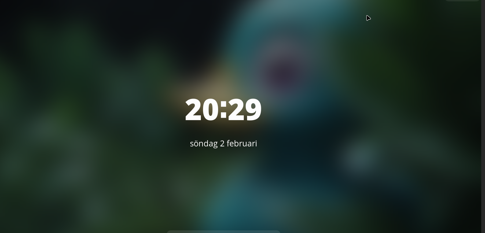
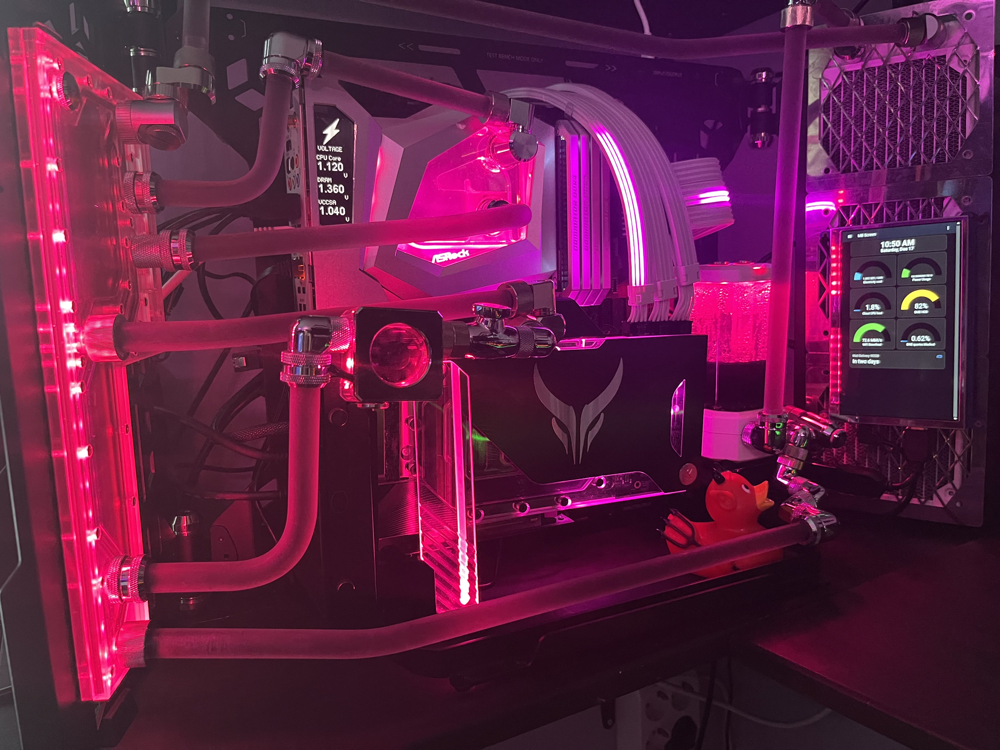
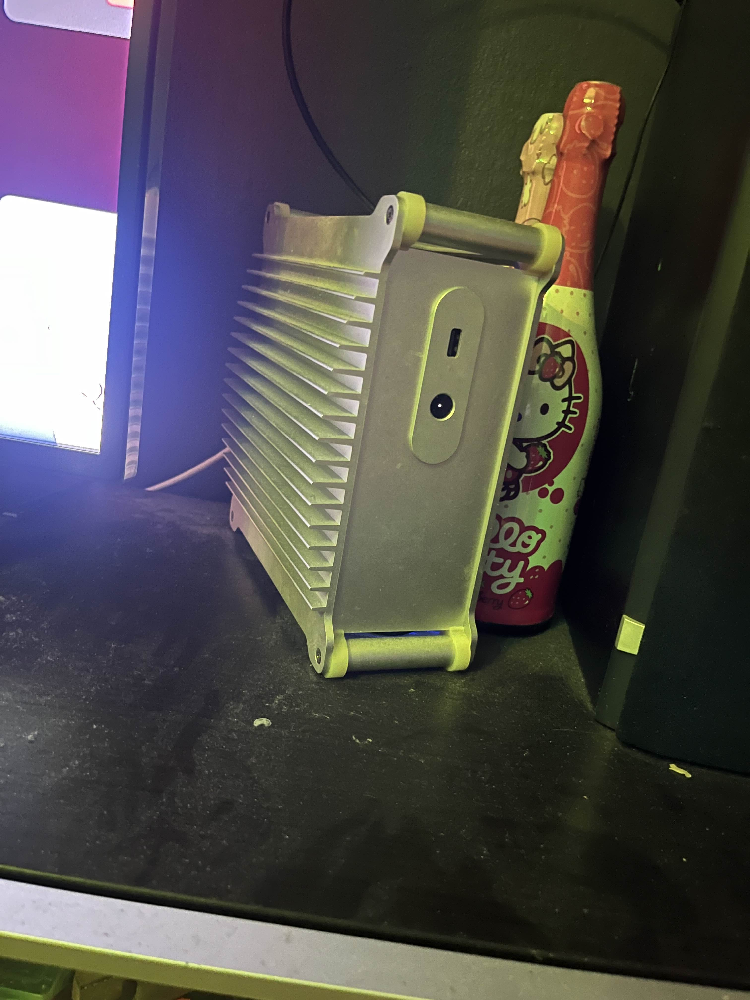

# ❄️🦆 **Flake: Just4Quackz** <br>

<div align="center">
<sub>

 _by blind noob_ 
 
</sub></div>


> [!CAUTION]
> __Do not__ use this flake with my hardware files. <br>
> Use your own! <br>

<details>
<summary>

## ⁉️ Introduction
    
</summary><br>

This repo contains NixOS configuration flake for my personal machines on home network. <br>
This flake holds everything neeeded to build, run, maintain - <br>
and restore and recover my devices. <br> 
🧑‍🦯 🧑‍🦯 🧑‍🦯  <br>

<p align="center"> </p> <br>


<br><br>

**❄️ This flake main focus will be on:** 

- **Custom Accessibility** 
- **Good Reproducibility**
- **& Easy Usage**

<br>

<details><summary>

🔧 **Components**

<br>
</summary>

| Component        | Version/Name                   |
| ---------------- | ------------------------------ |
| Distro           | NixOS                          |
| Shell            | Bash                           |
| Display Server   | Wayland                        |
| Bar              | OpenBar                        |
| Notification     | libnotify                      |
| Editor           | vim / Getty                    |
| Terminal         | Ghostty                        |
| Prompt           | Starship
| Fetch Utility    | Neofetch                       |
| Theme            | Custom                         |
| File Browser     | Thunar                         |
| Internet Browser | Custom Firefox                 |
| Intent Recognition | Hassil                       |
| Speech To Text   | Faster Whisper                 |
| Wakeword         | Open Wake Word                 |
| Clipboard        | nix-shell -p (optional)        |
| Display Manager  | Gnome                          |
| Containerization | Docker                         |
| Virtualisation   | qemu + virt-manager + libvirtd |
| VPN              | WireGuard
<br>
</details>


------------

</details>


<details>
<summary>
    
## 🖥️ __Machines__
    
</summary><br>


__Auto Installer ISO__
<br>
Flash to USB. Boot. <br>
_(formats, partitions & installs Nix OS)_

<br>

```bash
sudo nix build github:QuackHack-McBlindy/auto-installer-nixos#nixosConfigurations.installer.config.system.build.isoImage
```

<br>

<details>
<summary>__Desktop__</summary>
<br>

**Desktop** <br>

<br>

Main machine.  <br> 
Custom Waterloop, without the water.  <br>

<br>

[](https://drive.proton.me/urls/JWCZ3V4RXC#SWOA0zI4eRlm)

<br>


**System:** x86_64-linux <br>

```bash
sudo nixos-rebuild switch --flake github:QuackHack-McBlindy/dotfiles#desktop
```


<br>


<details><summary>

⌨ **Keybindings**

</summary>


| Key Combination           | Action                                                                |
| ------------------------- | --------------------------------------------------------------------- |
| NUM +                      | Magnifier Zoom In                                                     |
| NUM -                      | Magnifier Zoom Out                                                    |
| NUM /                      | Screen Reader Toggle                                                  |
| §                          | Open Terminal                                                          |
| CTRL + Q                   | Close open window                                                      |
| CTRL + W                   | Open Firefox                                                          |
| CTRL + E                   | Open Editor                                                           |
| ALT/SUPER + TAB            | Switch Windows                                                          |

<br>

All keybindings for this device are listed [here](https://github.com/QuackHack-McBlindy/dotfiles/blob/main/home-manager/keybindings-desktop.nix)
<br>

</details>

------------

</details>

<details><summary>

__Laptop__

</summary><br>

**Laptop** <br>

Old crappy laptop.<br>

**System:** x86_64-linux <br>

```bash
sudo nixos-rebuild switch --flake github:QuackHack-McBlindy/dotfiles#laptop
```

<br>


<details><summary>

⌨️ **Keybindings**

</summary>


| Key Combination           | Action                                                                |
| ------------------------- | --------------------------------------------------------------------- |
| Page_Up                    | Magnifier Zoom In                                                     |
| Page_Down                  | Magnifier Zoom Out                                                    |
| NUM /                      | Screen Reader Toggle                                                  |
| §                          | Open Terminal                                                          |
| CTRL + Q                   | Close open window                                                      |
| CTRL + W                   | Open Firefox                                                          |
| CTRL + E                   | Open Editor                                                           |
| ALT/SUPER + TAB            | Switch Windows                                                          |

<br>

All keybindings for this device are listed [here](https://github.com/QuackHack-McBlindy/dotfiles/blob/main/home-manager/keybindings-laptop.nix)
<br>

</details>

------------

</details>


<details><summary>

__Nasty__

</summary><br>

**Nasty** <br>

Huge Mass Storage NAS - Creates Pool with mergerfs.<br>
15x 3.5" drives. Runs media servers and rreverse proxy.<br>
**System:** x86_64-linux <br>

```bash
sudo nixos-rebuild switch --flake github:QuackHack-McBlindy/dotfiles#nasty
```

<br>

------------
</details>

<details><summary>

__Tiny__

</summary><br>

**Tiny** <br>

Raspberry Pi 4B with hardware raid. <br>
**System:** aarch64-linux <br>

```bash
sudo nixos-rebuild switch --flake github:QuackHack-McBlindy/dotfiles#tiny
```


<br>

------------
</details>

<details><summary>

__Homie__

</summary><br>

**Homie** <br>


Smaall fanless server to run my smart home devices and everything related. <br> 
<br>


<br><br>


**System:** x86_64-linux <br>

```bash
sudo nixos-rebuild switch --flake github:QuackHack-McBlindy/dotfiles#homie
```

<br>

------------
</details>

<details><summary>

__Phone__

</summary><br>

PinePhone <br>
**System:** aarch64-linux <br>


<br>

------------
</details>

<details><summary>

__Smart Watch__

</summary> <br>

**Smart Watch** <br>

ESP32 Smart Watch.  <br> 

**System:** ESP32-S3 T-Watch LoRa <br>

<summary>

**Build**

</summary> <br>

```Build & flash USB Connected ESP Watch
invoke build watcg
```

<br>

------------
</details>

<details><summary>

__Box3__

</summary> <br>

**Box3** <br>

A ESP32-S3-Box3 used as a voice assistant.  <br> 

**System:** ESP32-S3-Box3 <br>

<summary>

**Build**

</summary> <br>

```Build & flash USB Connected ESP Watch
invoke build box3
```

<br>


------------
</details>
</details>


<details>
<summary>

    
## 🚀 Features
    
</summary><br>


<details>
<summary>

__Accessibility__

</summary><br>

__Text To Speech__

Custom orca configuration, with Piper TTS and langid for auto detecting language of text and provide correct model. <br>
This wide TTS configuration icludes: Discord TTS, Conversation agent responses, notifications, some terminal commands and of course the screen reader. <br> <br>

__Voice Control__

Microphones on every device, and wide range of custom voice commands to handle everday tasks. <br>
Make a friendly request to the assistant by yelling `YO BITCH!` <br> <br>

------------
</details>

<details>
<summary>

__Secret Management__

</summary>
File encryption and secrets management is handled with three core components. <br>
AGE <br>
sops-nix <br>
Yubikey <br> <br>

With effective and secure bash scripts creating and maintaing secrets and keys is as easy as touching a key, or typing `encrypt`. <br>

------------
</details>


------------
</details>

</details>

<details>
<summary>
    
## 🌐 Networking
    
</summary><br>

Reverse proxy with Caddy.


</details>


<details>
<summary>
    
## 🧑‍🦯 Scripts
    
</summary><br>

**Some fun, lazy & crazy beginner friendly helpers** <br>

<details><summary>

**Navigation / File Management** 

</summary><br>

```cd``` Fuzzy & Lazy navigation with fzf. <br>
```jump``` Opens File Manager in current directory. <br>
```cp``` Lazy & safe cp. <br>
```mv``` Lazy & safe mv <br>
```rm``` Lazy & safe rm. <br>
```scpd``` Local file transfering made easy using SSH, SCP & Gum. <br>
```extract <file_path>``` Extract compressed files <br>
```compress <files>``` Compress selected files. <br> 
```mp3``` lists mp3 files and plays chosen file. <br>

<br> </details>
<details><summary>

**OS** 

</summary><br>

```rb``` Rebuild & switch current system. <br>
```services``` Lists systemd servces with log preview and optionally restart selected service. <br>
```hm-logs``` Searches home-manager logs and renames backup files if any conflict is found. <br>
```flash``` Lazy flasher. <br>

<br> </details>


<details><summary>

**Secrets** 

</summary><br>

```new-secret``` Helper to create new sops-nix secrets. <br>
```sopsd <secret_name>```  Returns temporary decrypted sops secret. <br>
```encrypt <file_path>``` Encrypt file wuth AGE and Yubikey. <br>
```decrypt <file_path>``` Decrypt file wuth AGE and Yubikey. <br>
------------ 
<br> </details>


<details><summary>

**Misc** 

</summary><br>

```say <text>``` Text to Speech with Piper and LangID for language detection. <br>
```weather``` Tiny weather report. <br>
```con``` Conversation (text) agent. <br>

------------ 
<br> </details>


<details><summary>

**Clean-up** 

</summary><br>

```clean``` Nix OS garbage collection <br>
```cleand``` Nix OS garbage collection <br>
```flush``` Cleans tmp and empty trash. <br>
```docker-prune``` Very Extensive gum Interactive Docker clean-up script with before and after quick disk analyzing. <br>
------------ 
<br> </details>


</details>


</details>

