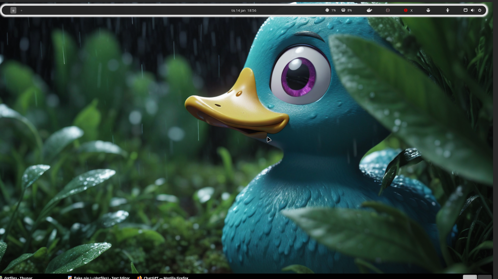
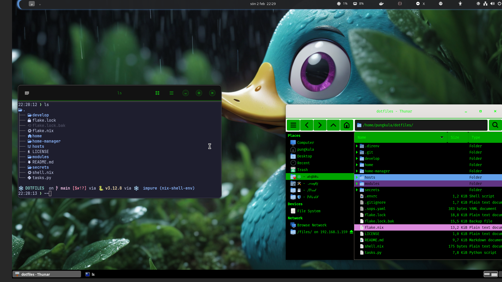

# ❄️🦆 **Flake** <br><br>
<details>
<summary>

## 🗒 Introduction
    
</summary><br>

This repo contains NixOS configuration flake for my hosts on my home network/homelab. <br>




<br><br>

**❄️ This flake main focus will be on:** 

- **Custom Accessibility**
- **Good Reproducibility**
- **& Easy Usage**

<br>

<details><summary>
🔧 Components
</summary>

| Component        | Version/Name                   |
| ---------------- | ------------------------------ |
| Distro           | NixOS                          |
| Shell            | Bash                           |
| Display Server   | Wayland                        |
| WM (Compositor)  |                       |
| Bar              | OpenBar                        |
| Notification     | notifyd                          |
| Launcher         |                         |
| Editor           | nano                        |
| Terminal         | Gnome-Terminal                         |
| Fetch Utility    | Neofetch                       |
| Theme            |            |
| Font             |   |
| File Browser     | Thunar    |
| Internet Browser | Customized Firefox                        |
| Screenshot       |                        |
| Clipboard        | wl-clipboard                   |
| Idle             |                        |
| Lock             |                        |
| Logout menu      |                         |
| Display Manager  | Gnome                        |
| Containerization | Docker                         |
| Virtualisation   | qemu + virt-manager + libvirtd |

<br>
</details>


------------

</details>


<details>
<summary>
    
## 🖥️ Hosts
    
</summary><br>


<details>
<summary>Desktop</summary> <br>

**Desktop** <br>

Main machine.  <br> 
Brag build for SteelSeries World Championchip Builds. <br><br>

**System:** x86_64-linux <br>

```bash
sudo nixos-rebuild switch --flake github:QuackHack-McBlindy/dotfiles#desktop
```

<details><summary>
**Build** </summary> <br>

*Auto Installer ISO (formats, partitions & installs)* 

```bash
sudo nix build .#desktop
```

<br></details>


<details>
<summary>⌨ **Keybindings**</summary>


| Key Combination           | Action                                                                |
| ------------------------- | --------------------------------------------------------------------- |
| NUM +                      | Magnifier Zoom In                                                     |
| NUM -                      | Magnifier Zoom Out                                                    |
| NUM /
| Screen Reader Toggle                                                  |
| §                          | Open Terminal                                                          |
| CTRL + Q                   | Close open window                                                      |
| CTRL + W                   | Open Firefox                                                          |
| CTRL + E                   | Open Editor                                                           |
| ALT/SUPER + TAB            | Switch Windows                                                          |

<br>

All keybindings for this device are listed [here](https://github.com/QuackHack-McBlindy/dotfiles/blob/main/home-manager/keybindings-desktop.nix)
<br>


</details>

------------
</details>

<details>
<summary>Laptop</summary><br>

**Laptop** <br>

Old crappy laptop.<br>

**System:** x86_64-linux <br>

```bash
sudo nixos-rebuild switch --flake github:QuackHack-McBlindy/dotfiles#laptop
```

<details><summary>
**Build** </summary> <br>

*Auto Installer ISO (formats, partitions & installs)*
```bash
nix build .#laptop
```

<br></details>


<details>
<summary>⌨ **Keybindings**</summary>


| Key Combination           | Action                                                                |
| ------------------------- | --------------------------------------------------------------------- |
| Page_Up                    | Magnifier Zoom In                                                     |
| Page_Down                  | Magnifier Zoom Out                                                    |
| NUM /                      | Screen Reader Toggle                                                  |
| §                          | Open Terminal                                                          |
| CTRL + Q                   | Close open window                                                      |
| CTRL + W                   | Open Firefox                                                          |
| CTRL + E                   | Open Editor                                                           |
| ALT/SUPER + TAB            | Switch Windows                                                          |

<br>

All keybindings for this device are listed [here](https://github.com/QuackHack-McBlindy/dotfiles/blob/main/home-manager/keybindings-laptop.nix)
<br>


</details>


------------
</details>

<details>
<summary>Nasty</summary><br>

**Nasty** <br>

Huge Mass Storage NAS - Creates Pool with mergerfs.<br>
15x 3.5" drives. Runs media servers and rreverse proxy.<br>
**System:** x86_64-linux <br>

```bash
sudo nixos-rebuild switch --flake github:QuackHack-McBlindy/dotfiles#nasty
```

<details><summary>
**Build** </summary> <br>

*Auto Installer ISO (formats, partitions & installs)*

```bash
sudo nix build .#nasty
```

<br></details>


------------
</details>

<details>
<summary>Tiny</summary><br>

**Tiny** <br>

Raspberry Pi 4 server with raid 1 - for personal data storage. <br>
**System:** aarch64-linux <br>

```bash
sudo nixos-rebuild switch --flake github:QuackHack-McBlindy/dotfiles#tiny
```


<details><summary>
**Build** </summary> <br>

*build rpi4 iso*

```bash
...
```

<br></details>


------------
</details>

<details>
<summary>Homie</summary><br>

**Homie** <br>

Smaall fanless server to run my smart home devices and everything related. <br>
**System:** x86_64-linux <br>

```bash
sudo nixos-rebuild switch --flake github:QuackHack-McBlindy/dotfiles#homie
```

<details><summary>
**Build** </summary> <br>

*Auto Installer ISO (formats, partitions & installs)*

```bash
sudo nix build .#homie
```

<br></details>


------------
</details>

<details>

<summary>Phone</summary><br>

PinePhone <br>
**System:** aarch64-linux <br>

<details><summary>
**Build** </summary> <br>

```Installer ISO (flash to SD card & install on internal)
sudo nix build .#phone
```

<br></details>


------------
</details>

<details>
<summary>Smart Watch</summary> <br>

**Smart Watch** <br>

ESP32 Smart Watch.  <br> 

**System:** ESP32-S3 T-Watch LoRa <br>

<details><summary>
**Build** </summary> <br>

```Build & flash USB Connected ESP Watch
invoke build watcg
```

<br></details>

------------
</details>

<details>
<summary>Box3</summary> <br>

**Box3** <br>

A ESP32-S3-Box3 used as a voice assistant.  <br> 

**System:** ESP32-S3-Box3 <br>

<details><summary>
**Build** </summary> <br>

```Build & flash USB Connected ESP Watch
invoke build box3
```

<br></details>


------------
</details>

<br><br>


</details>


<details>
<summary>
    
## 🚀 Features
    
</summary><br>


<details>
<summary>Accessibility</summary><br>

Custom orca configuration, with Piper TTS and langid for auto detecting language of text and provide correct model. <br>


------------
</details>

<details>
<summary>Secret Management</summary>
sops-nix <br>
age-plugin-yubikey <br>

------------
</details>


------------
</details>

</details>

<details>
<summary>
    
## 🌐 Networking
    
</summary><br>


wip


</details>


<details>
<summary>
    
## 🧑‍🦯 Scripts
    
</summary><br>

**Some fun and lazy beginner helpers** <br>

<details><summary>

**Navigation / File Management** 

</summary><br>

```cd``` Fuzzy & Lazy navigation with fzf. <br>
```cp``` Lazy & safe cp. <br>
```mv``` Lazy & safe mv <br>
```rm``` Lazy & safe rm. <br>
```scpd``` Local file transfering made easy using SSH, SCP & Gum. <br>
```extract <file_path>``` Extract compressed files <br>
```compress <files>``` Compress selected files. <br> 
```mp3``` lists mp3 files and plays chosen file. <br>

<br> </details>
<details><summary>

**OS** 

</summary><br>

```rb``` Rebuild & switch current system. <br>
```services``` Lists systemd servces with log preview and optionally restart selected service. <br>
```hm-logs``` Searches home-manager logs and renames backup files if any conflict is found. <br>
```flash``` Lazy flasher. <br>

<br> </details>


<details><summary>

**Secrets** 

</summary><br>

```new-secret``` Helper to create new sops-nix secret. <br>
```encrypt <file_path>``` Encrypt file wuth AGE and Yubikey. <br>
```decrypt <file_path>``` Decrypt file wuth AGE and Yubikey. <br>
------------ 
<br> </details>


<details><summary>

**Misc** 

</summary><br>

```say <text>``` Text to Speech with Piper and LangID for language detection. <br>
```weather``` Tiny weather report. <br>
------------ 
<br> </details>


<details><summary>

**Clean-up** 

</summary><br>

```clean``` Nix OS garbage collection <br>
```cleand``` Nix OS garbage collection <br>
```flush``` Cleans tmp and empty trash. <br>
```docker-prune``` Very Extensive gum Interactive Docker clean-up script with before and after quick disk analyzing. <br>
------------ 
<br> </details>


</details>


</details>

